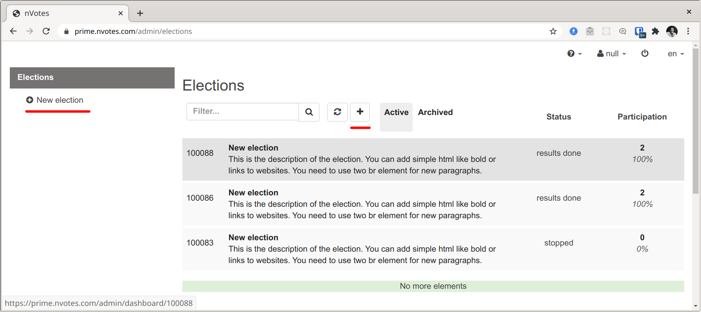
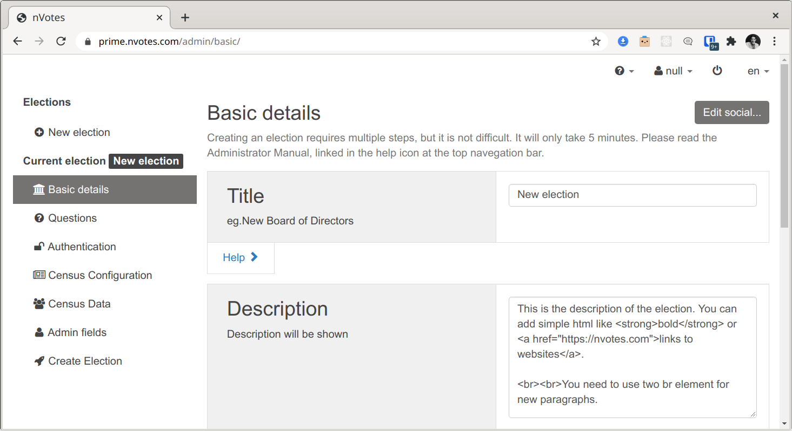
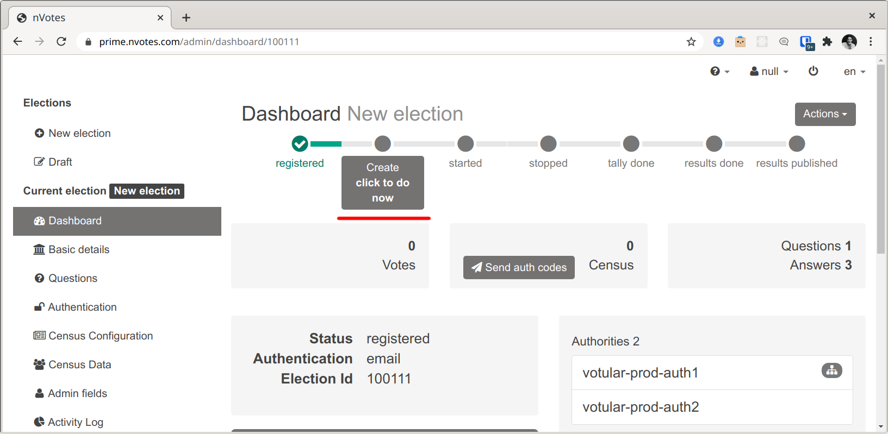

In the Admin interface, given enough permissions you can create new
elections using the `New Election` buttons highlighted below:



Once you click there, you will something like the following, where you can
graphically configure the main settings of an election like the election title,
description, etc:



Using the left sidebar, you can access other configuration sections like
`Questions` or `Authentication`. However, it is currently not possible to 
graphically configure some more advanced election settings. To be able to 
configure these advanced, settings, click in the last sidebar item 
`Create Election`:


The `Create Election` sidebar section is the last step of election configuration, 
where you can review the configuration before creating the election. At this 
point, the election is configured - with some sample configuration if you 
didn't change anything.

If in the `Create Election` sidebar section you click in the pencil icon at the 
top, you will access the `Edit Election Json` dialog, in which you can directly
edit in JSON format the election configuration:


## Election JSON settings

<!-- 
Note that we name this file ./assets/sample_config.yml even if it is a JSON file
because otherwise it would fail to compile and it would force us to put assets 
in /static/ directory, which results in a much a less self-contained file tree.
-->
In this section we will describe the different options that can be configured 
in the Edit JSON Dialog for Election Creation.  You review an example of a 
[sample election JSON configuration here](./assets/sample_config.yml).

As can be seen in the last screenshot, the JSON Format starts with a list. This
is a list of Elections. This means you can directly create multiple elections at
once like this:

```json title="multiple_elections.json"
[
  {
    ...Election 1 configuration..
  },
  {
    ...Election 2 configuration..
  },
  {
    ...Election 3 configuration..
  },
]
```

Once you click on the `Finish edit` in the `Edit Election Json` dialog, if you
have added multiple elections this will be reflected in the interface.

### Election

An election can have the following settings

| Name | Type | Required | Default | Description |
| --- | --- | --- | --- | --- |
| `id` | `Positive Integer` | No | None | Election's unique id. It will automatically be assigned one if none is set. If the election already exists and the user has permissions to edit it, it will be updated if the election is registered but not yet created ([see below](#modifying-elections)). |
| `title` | `Short String` | Yes | - | Election's title. It will appear in the admin election list, and as the election title in the public election site and in the voting booth start screen. |
| `description` | `Long String` | Yes | - | Election's description. It will appear below the title in the public election site and in the voting booth start screen. |
| `start_date` | `String` | Yes | - | DEPRECATED. This field is required but should really be an empty string as it is currently unused. |
| `end_date` | `String` | Yes | - | DEPRECATED. This field is required but should really be an empty string as it is currently unused. |
| `director` | `String` | Yes | - | The name of the election authority that will act as the director for this election. Its eopackage needs to be installed in the backend server ([see details](../deployment/guide#connecting-web-servers-with-authorities)). |
| `authorities` | `List<String>` | Yes | - | List of names of all the election authorities that should be included in this election, excluding the director authority name. Its eopackages needs to be installed in the backend server ([see details](../deployment/guide#connecting-web-servers-with-authorities)). |

## Creating elections

In the `Create election` sidebar section, you can review (and edit the json) of
the election(s) you are about to create in the system. At this point, the 
elections are usually not yet created in the backend and exists only as a JSON
configuration in your web browser. There's an exception to that, that we will
discuss later in this section.

Election creation compromises multiple steps. As seen in
[Election Creation JSON settings](#election-creation-json-settings)), multiple
elections can be created at once in the `Create election` sidebar section. 

For each election, the web browser will request in order to execute the 
following steps:
1. **Create the AuthEvent**: An Authevent represents an event which has some 
specific voter authentication configuration and census of voters.
2. **Add the voter census**: The voter census data is added to the just 
registered AuthEvent.
3. **Register the Election**: The election is registed in `agora-elections`, the
ballot box API.

When an election is registered in `agora-elections`, the election public keys 
and private are not yet created and no communication with the election 
authorities has happened yet. At this stage, the election configuration can be
modified later on.

If you look at the `Create election` sidebar section, there's a checkbox option
below to choose if just registering the election or also creating it:


This checkbox is checked by default but can be disabled just by clicking on it.
If disabled, the elections will just be registered but not created. This allows
for changing the elections later on as will be discussed in the next section.

If the checkbox is checked, then the elections' public and private keys will be
created. This will happen after the previous three steps of AuthEvent creation,
census import and election registration has happened for all the elections. The 
creation of the public and private keys is the slowest part of the process and 
it takes around 30 seconds for each question with two election authorities.

Election's public and private keys creation can be requested later when an 
election is in `registered` state by clicking in `Create` button from the 
election dashboard:



## Modifying elections

:::caution
Elections can only be modified in `agora-elections` if virtual elections are
allowed in the deployment configuration, which can be enabled with the
`config.agora_elections.virtualElectionsAllowed` setting in the `config.yml`
deployment configuration file. This setting is set to `false` by default 
because for security reasons virtual elections should not be enabled in 
multi-tenant deployments.
:::

When creating and configuring an election and more so if we are perhaps talking
about advanced election configuration options set in JSON for a set of multiple
elections, it's useful to register it but be able to edit it later.

One straightforward way to do this is having the elections' JSON configuration
in a file, copy and paste it into the `Edit Election JSON` dialog inside the 
`Create election` sidebar section, and click the `Create the elections` button
with the checkbox `Not only register the election, but also create it at the election authorities. This means you won't be able to modify the election.` unchecked. You will have to
ensure that each election has a specific id assigned in the elections' JSON
configuration.

Once the elections are registered, you can enter each election dashboard and
from there access the Demo voting booth and see if it works as expected, and
you can even start or stop the elections and try to vote to see if the
authentication worked. You won't be able to vote and the voting booth will fail
to encrypt the ballot because at this point the elections' private and public
keys are not created yet.

If there's any detail that you need to change, you can edit the elections JSON
configuration file, and then proceed again to follow the steps before for 
creating the election: copy and paste the configuration into the 
`Edit Election JSON` dialog inside the `Create election` sidebar section and
click again to create the elections. This will update the elections' 
configuration as the system will have detected when an election with the 
specified id already exists and can be edited as it's registered but not created.

Once the final elections configuration is in place, you can try to follow the 
same election creation/update procedure, but ensuring the checkbox to create
the elections is checked.

In that case, the elections will first be updated (first the AuthEvent, then the
census, and then the election), and then the public and private keys will be
created.