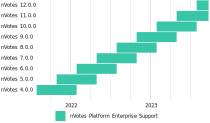

New releases of Sequent Platform are published on a regular cadence. Support for
these releases is also performed in a predictable manner so that the community,
businesses and developers can plan upgrades, contributions and access to the
latest version within a reasonable roadmap.

## Version numbers

Sequent Platform follows a [Semantic Versioning scheme](https://semver.org/). 
Each  release has a version number following the `major.minor.patch` pattern and
each version number is increased monotonically. For  example, `2.1.0` is valid 
version number.

### Version numbers for each project

[Multiple projects](https://github.com/sequent/) compromise Sequent platform 
architecture: voting-booth, ballot-box, election-orchestra, etc.

Patch releases for bugfixes or security updates are published 
independently for each project. For example `tally-methods` might be published 
with version `4.0.3` while `tally-pipes` stays at `4.0.1`.

Feature release versions are published at once for all projects of the release.
A Feature release can either be a new major or minor version, depending if the 
release contains backwards incompatible new features. This allows us to ensure 
sure that any `voting-booth` release versioned `5.1.x` (for example  `5.1.1` 
or `5.1.11`) will work with `common-uis` version `5.1.x`.
## Release cadence and Enterprise Support

Feature releases are published every 3 months in February, May, August and 
November each year. Sequent offers up to 6 months of 
[Enterprise Support](https://sequentech.io) to its partners and clients for all 
Feature releases.

## Feature Release schedule

Each Feature release will be published under a schedule that includes:
- A feature freeze date, usually 1 month before the final release date.
- A beta release, usually 2 weeks before the final release date.

The schedule will be published in anticipation so that everyone can participate
and coordinate it.

## Security and bugfix updates

Sequent platform depends on multiple dependencies and these dependencies 
regularly publish security updates. Every 2 weeks, Sequent will review these
dependencies and publish a patch release to keep up with the security updates.
If there is any major security issue, a security release might be published
earlier. Bugfixes (if any) will also be included in these bi-weeekly releases. 

## Specific purpose beta releases

Due to enterprise requirements, Sequent might publish Specific purpose beta 
releases of Sequent platform. These will only follow an Enterprise Support Plan
ad-hoc for the specific-purpose of these beta releases. These beta releases will
be considered a beta for the next Feature release - i.e. next major or minor 
version depending on the case.

## Proprietary modules releases

Sequent platform follows an open core licensing model. With respect to release
management and support plans, these proprietary modules follow the same rules
as the open source projects explained above.