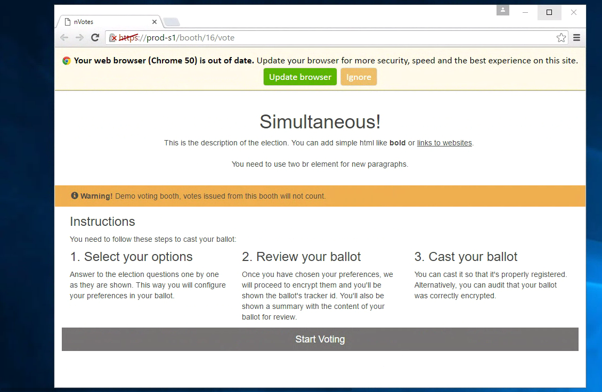
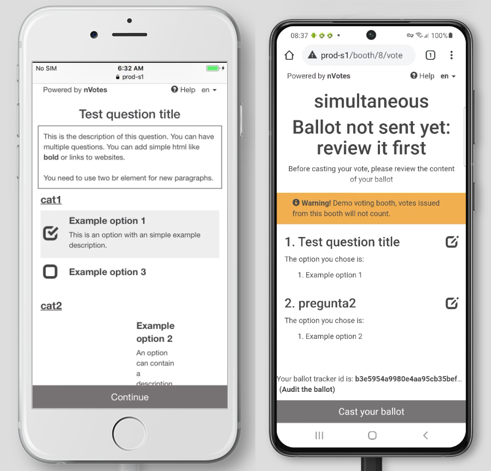
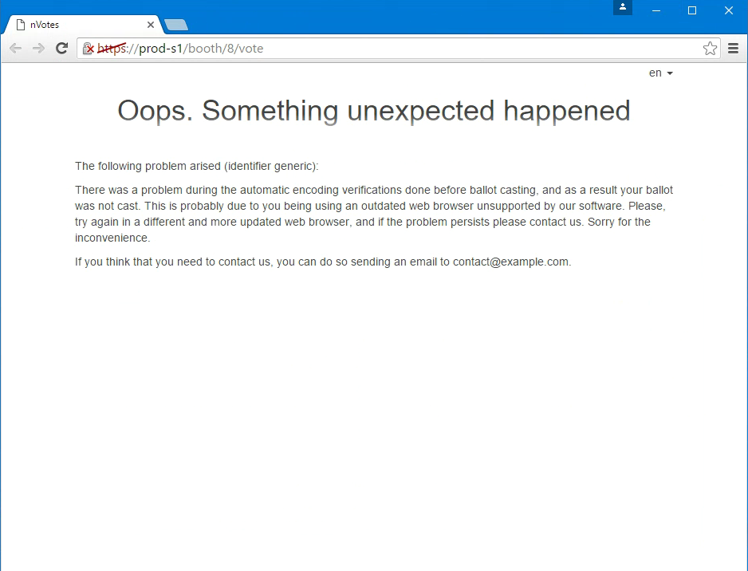
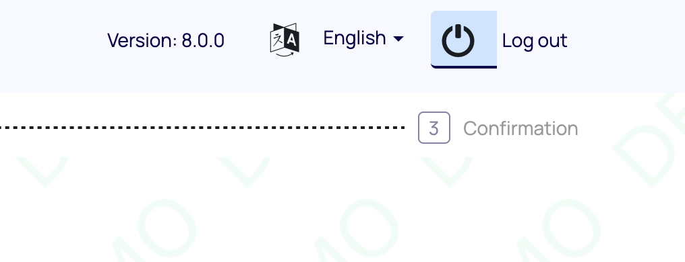
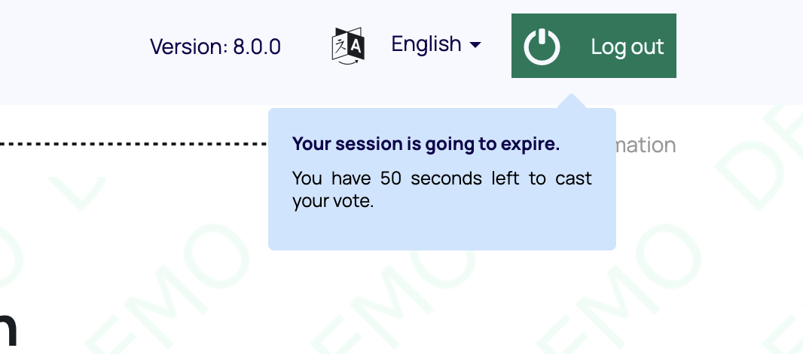

## 1. Supported browsers

The web interface should work correctly on any modern browser. It's
always recommended to use the most updated version of your favourite browser to
have more security, but the interface can work on older versions if required.

The interface has been tested with the following browsers version and newer:

 * Mozilla Firefox 36
 * Google Chrome 50
 * Microsoft Edge 15 (All versions)
 * Safari 7.1
 * Safari on iPhone 5 (iOS v7)
 * Chrome on Android (v6)

We use https://browser-update.org to check the web browser used by the user
and notify the user if it's unsupported. If the browser is too old the user 
get the following notification:



You can disable this option in the `config.yml` deployment configuration file, 
just disabling the `config.sequent_ui.browser_update_config` option. If that 
option is set to `false`, we don't check the browser version.

The minimum browser version is also configurable in a deployment. The default
value can be modified in the `sequent-ui/templates/SequentConfig.js` in 
`deployment-tool`, updating the `browserUpdate` field, but that requires a bit 
more of knowledge as you need to edit the ansible template and re-deploying.

### Mobile browsers

The voting interface is responsive, that means that it adapts to the browser
size and this makes the application usable on mobile phones:



### Javascript and old browsers

The web interface requires javascript to work, so make sure that you don't have
javascript disabled on your browser.

The minimum required version of javascript is the ES6 (ECMAScript 2015). This
version is supported on most browsers, but it's not supported on Microsoft
Internet Explorer 11, so this browser is not supported.

In some old browsers, it's possible that the interface works but the encryption
fails with an error like this:



In any case, this kind of errors only occurs in the unsupported browsers, and
the `browser-update` library will show a warning about the usage of an old
browser in those cases.

### Insecure browsers

By default, we set `insecure: true` setting of the `browser-update` library. 
This means that all browser that are severely insecure get notified. "Severely
insecure" means that the browser has security issues that allow remote code 
execution and similar stuff, and that they are being actively exploited on 
the Internet.

At the moment of writing this document, it means that anyone using a web browser
older than the following ones will get the notification for security reasons, 
**even if the browser is supported by our software**:

 - Edge/IE < 16
 - Firefox < 76
 - Opera < 62
 - Safari < 11.1.1
 - Chrome < 88.0.4324.150

If you want to disable this feature, which we don't recommend, you should change
the `config.sequent_ui.browser_update_config` setting in the `config.yml` 
deployment configuration file, setting `insecure: false`:

```yaml title="config.yml fragment" {7}
    # Shows a dialog if the browser is too old to notify the user. Set this to
    # false to disable. See how to customize in
    #  http://browser-update.org/customize.html
    browser_update_config: >
      {
        required: {e:15,f:36,o:65,s:7,c:50},
        insecure:false,
        api: "2021.04"
      }
```

## 2. Required and allowed cookies

Sequent uses the bare minimum cookies needed for the interface usability. These
cookies are the needed to login and for security reasons.

There's no tracking code or external cookies, all the cookies used by the
Sequent interface are used just as an local storage for the interface state, and
in any case these cookies are sent to any external server, they are just used
to be able to query the API with the authentication and the corresponding
parameters.

You can check the cookies present and the use in the following lists by GUI
module.

### Used in all modules

 * **lang**: Used to store the interface language. It'll be set even without
   login to keep track of the language selected by the user for the next use.
   again. These cookies are present until the user logouts.

### Admin

 * **authevent**: A set of cookies used to store the admin interface state.
   This is used to keep the user loged in if the browser is closed and opened
   again. These cookies are present until the user logouts.

### Booth

 * **authevent**: A set of cookies used to store the booth interface state.
   In the booth we just store:
    * The current election ID
    * The user email and authentication token
    * If the user is admin
   These cookies are removed once the user emits the vote.

### Election

No special cookies are used here.

### Configuration

The login session cookies expiration time can be configured using `config.yml`.
The most important cookies are the ones that hold the authentication token. You
can configure different expiration times for the `voting-booth` and the
`admin-console`.

To configure the cookie expiration time for the voting booth, as well as the 
authentication token expiration time, find the line with the 
`config.iam.auth_token_expiration_seconds` configuration in the `config.yml` 
deployment configuration file and change it. The expiration time will be set in
seconds. For example an hour would be `3600` seconds. The default
value is ten minutes or `600` seconds.

To configure the cookie/auth token expiration time for the admin console, find
the line with the `config.iam.admin_auth_token_expiration_seconds` configuration
in the `config.yml`  deployment configuration file and change it. The default
value is one hour or `3600` seconds.

### Voting Booth Logout warning modal

In the voting booth, a modal will pop up one minute before the authentication token
expires. This modal warns the user that they only have one minute left before
finishing to cast their ballot.

### Voting Booth progress bar logout

You can enable a feature to inform the user of exactly how much time they have left
to vote before the cookies expire. If you configure the `booth_log_out__countdown_seconds`
parameter in the election presentation as explained 
[here](../../reference/election-creation-json#election-presentation-booth_log_out__countdown_seconds),
a progress bar will show up in the background of the `Logout` button, to indicate
how much time the user has left to cast their ballot. The progress bar goes from
100% initially to 0% when the user runs out of time.  Also, if the user hovers the
mouse over the button, a tooltip will further inform the user with the minutes/
seconds they have left.

A screenshot is included below:



And the tooltip:



### Admin console token renewal

Although the cookies/auth token for the admin console have a limited lifetime, they
are automatically renewed when they reach their half-life. For this renewal process
to happen, the browser tab must be active.
