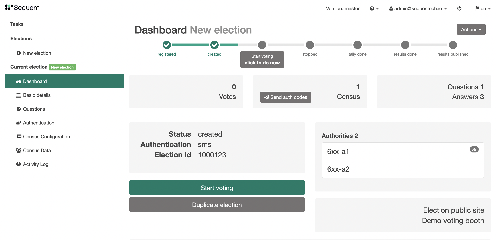
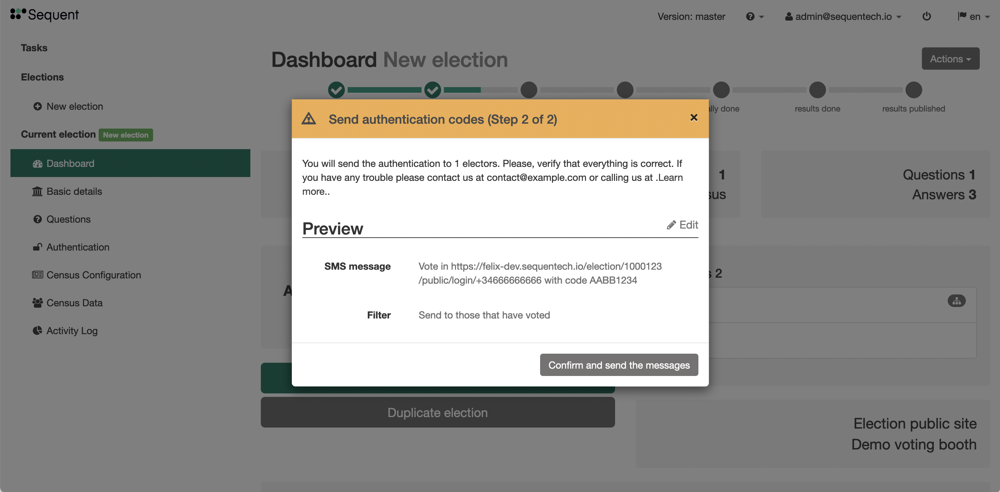
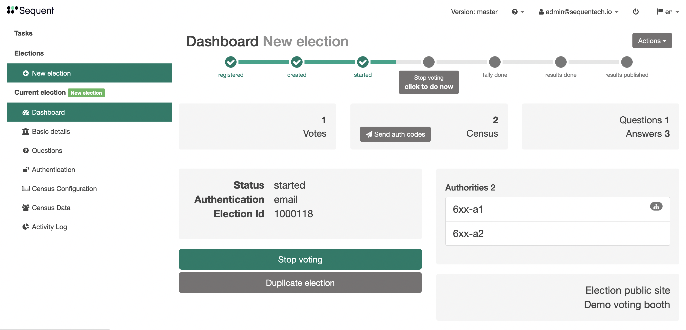
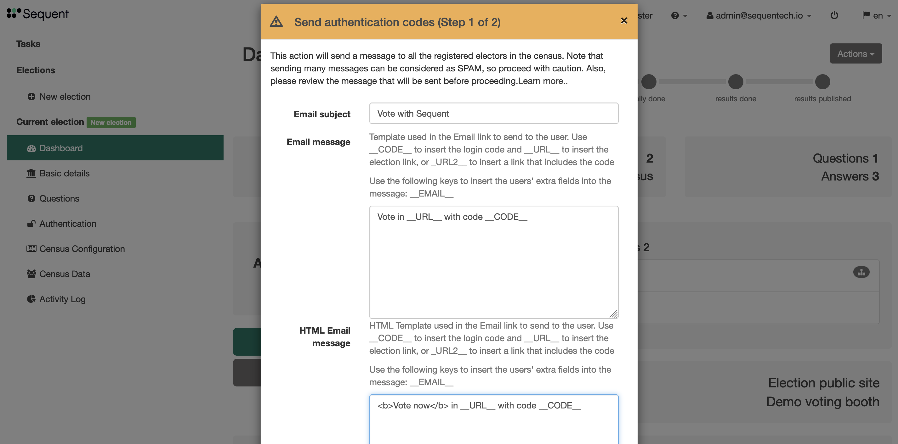
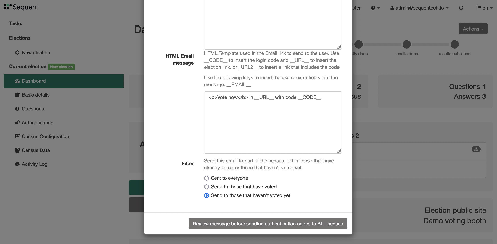
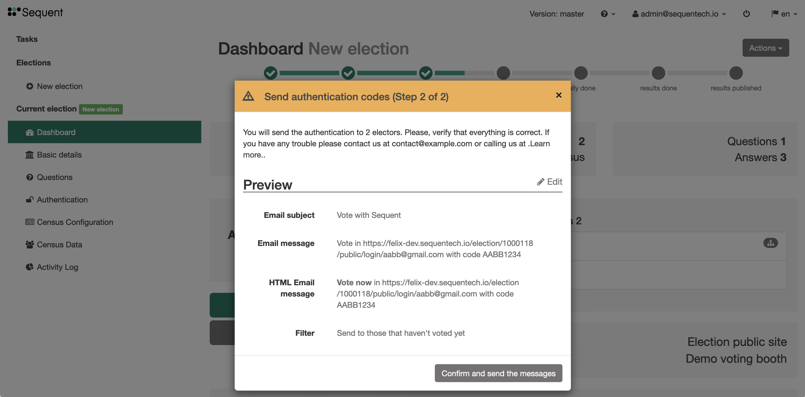

# Sending messages

You can send custom messages to voters at any time during the electoral process.
Those messages will be sent through sms or email depending on the authentication method.

As explained above, these messages are templates and can be used to send authentication
messages. Each voter will receive a tailored message with the template variables
substituted with their values. These template variables include `__URL__`, `__URL2__`,
`__CODE__`and `__<extra_field>__`.

You can send messages either send bulk messages to the whole census or send messages
to specific lists of users.

## Templating

This is the text body template used for sending the authentication codes to 
voters. It's only applicable to authentication methods that send authentication
codes to voters such as `email`, `email-otp`, `sms` or `sms-otp`. In the first
two this corresponds to the Plain Text body of the email message.

As mentioned earlier, this is a template. Each voter will receive a tailored
message with the template variables substituted with their values. Variables
are identified surrounded by two `_` characters and always in upper case. 
For example the variable `url` would appear as `__URL__`.

The allowed template variables are:
- `__URL__`: This is the voter authentication URL specific for the voter but
not containing the voter authentication code, which the voter will have to fill
out manually.
- `__URL2__`: This is the voter authentication URL containing the 
both the email/sms of the voter and the voter authentication code. If no other
[extra_field](#census-extra_fields) is required during authentication, entering  
in the `__URL2__` URLs allows voters to authenticate without having to fill out 
any web form. It's easier, but also more risky because anyone with this link 
could use it to authenticate.
- `__CODE__`: This is the authentication code. Each time the authentication 
codes are sent to a voter, a new code is generated and any old codes are 
disabled.
- `__<extra_field>__`: Each voter has some voter related information 
associated to it. You can use those extra fields by the 
[sluggified](https://docs.djangoproject.com/en/3.1/ref/utils/#django.utils.text.slugify) 
and uppercased [name](#extra-field-name) property.

The maximum length of the message text depends on the authentication method. By
default the email text body can have up to `5,000` characters, and SMS text
body can only have `200`. To change this, you would need to change the code
in the respective authentication method code. 
[This is the relevant code](https://github.com/sequentech/iam/blob/e9e980f8afd07e32098c487b7a8c3a9b4c5d575a/iam/authmethods/m_email.py#L140) 
in the `email` authentication method:

**Sending bulk messages**

In the election Dashboard, click on the `Send auth codes` button:

This will open a modal:

In the first screen of the modal, you can configure the message template to be sent. In
elections with an email authentication, you can configure the Email title, the text message
and an alternative html message. In elections with an SMS authentication, you can configure
the SMS message. Additionally, you can always select to filter the census by either
selecting only those that have already voted or those haven't voted yet.

The next screen shows the configuration you have selected, by replacing the template variables,
and showing the chosen filter configuration.

**Sending messages to specific users**

