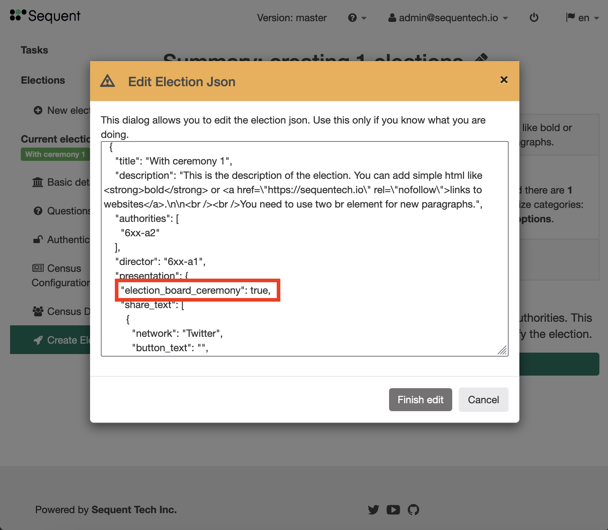

The objective of the Electoral Board Ceremonies is to ensure that the private keys of an electoral process are exclusively on the hands of their custodians while the voting is open. This is implemented in the following ceremonies:

- Keys Distribution Ceremony. In this ceremony the private keys for the election are retrieved and deleted from the trustees' servers and handed over to the custodians. This ceremony takes place before the voting period has started. This ensures no one can decrypt the ballots during the voting period.
- Opening Ceremony. In this ceremony the private keys for the election are handed over from the custodians and restored to the trustees' servers. This ceremony takes place after the voting period has ended. Restoring the private keys in the trustees' servers is a necessary step before the tally process can be started.

This is an advanced feature and it has to be manually enabled while creating the election. Also, this feature does not currently support parent/children elections.

The next sections are a step by step guide to:
- Election authority credentials
- Creating an election with the Electoral Board Ceremonies feature enabled.
- Keys Distribution Ceremony.
- Opening Ceremony.

## Election Authority Credentials

Note: this configuration needs to be done on the web servers. Once it's done, you don't need to do it again on next elections using Electoral Board Ceremonies.

Before we can use the Electoral Board Ceremonies feature, we need to configure the web servers to create credentials for the election authorities. Specifically, we need to configure a user/password for each of the authorities.

In order to see which authorities are connected to the web server, login into the web server and run:

```
    eopeers --list
```

This will show the list of all authorities connected to the web server, as well as possible slave servers. Each election uses a specific list of authorities, which can be a subset of that list, so we'll need to configure the user/password for at least the authorities the election is going to use.

To configure the user/password, login into the web server and change the `config.yml` file, which you'll find in a path similar to `/root/prod-s1/config.yml`. Find the YAML key `ballot_box.trustee_users` and fill it in with the user/password for all authorities you're going to use in the election:

```yaml
    trustee_users:
      - authority_id: auth1
        username: usera1
        password: pass1234
      - authority_id: auth2
        username: usera2
        password: pass1234
```

Now we need to provision the machine to apply the updated configuration. In this case we're only updating the `ballot-box` service so you can change the `playbook.yml` file (located in a path similar to `/root/prod-s1/playbook.yml`) and comment out all playbooks except for the ballot-box. This will make the deployment faster. The playbook will look similar to this:

```yaml
---
- hosts: all

tasks:
    - include_vars: config.yml
    - include_vars: repos.yml

#    - import_tasks: packages.yml
#    - import_tasks: system.yml
#    - import_tasks: hardening/main.yml
#    - import_tasks: sudoers/main.yml
#    - import_tasks: misc-tools/main.yml
#    #- import_tasks: eorchestra/main.yml
    - import_tasks: ballot-box/main.yml
#    - import_tasks: iam/main.yml
#    # - import_tasks: sentry/main.yml
#    - import_tasks: sequent-ui/main.yml
#    - import_tasks: oneserver/main.yml
#    - import_tasks: election-verifier/main.yml
#    #- import_tasks: halb/main.yml
#    - import_tasks: postgres_backups.yml
#    - import_tasks: crontab.yml
```

Then provision the machine as explained [here](../deployment). 

```bash
    date; time ansible-playbook -i inventory playbook.yml; date
```

## Election Creation Configuration

During the election creation process, in the last step, called "Create Election". Click on the pencil as shown in this image:


This will open a modal with a text field and the JSON configuration of the election. We need to change the configuration to enable the Electoral Board Ceremonies. Add a key `election_board_ceremony` with value `true` inside the `presentation` section, as shown below, and then click on `Finish edit`:



Finally click on the green button at the bottom `Create the elections`.

## Dashboard

Once the election is created, the ceremonies will be available in the Dashboard under the Actions dropdown:


## Keys Distribution Ceremony

In this ceremony, each election authority will download the share of the private keys for the election and the keys will be removed from the election authority servers. Note that this action can only be launched if the election is configured with `election_board_ceremony` set to `true`, and that the election cannot be started before this ceremony is successfully completed.

In order to start the ceremony, go to the election Dashboard and click on `Launch key distribution ceremony` under the `Actions` button. This will launch a modal:


You can see at the top the number of steps required to complete the ceremony. In this ceremony each election authority will need to complete the following steps:

* Login into the election authority account. The administrator of the Sequent servers must provide the user/password for the election authority.


* Download the share of the private keys. In this screen you can download the keys as many times as you need.


* Secure at least two copies of the private keys. Once you've copied the keys into two different USB memory sticks, check the two checkboxes and click `Next step`.


* Check the contents of the keys. Drag and drop the previously downloaded file to check its content.


* Delete the share of the private keys from the election authority's server.


After these steps are completed by all authorities, you'll see a final screen showing the success of the ceremony:


Note that if the modal is closed too early, it can be launched again. If the share of the private keys for some of the election authorities have already been deleted, the modal will continue from that point with the next election authority.

## Opening Ceremony

In this ceremony, each election authority will upload the share of the private keys for the election and the keys will be restored to the election authority servers. Note that this action can only be launched if the election is configured with `election_board_ceremony` set to `true`, after the voting period is stopped, and that the tally cannot be started before this ceremony is successfully completed.

In order to start the ceremony, go to the election Dashboard and click on `Launch opening ceremony` under the `Actions` button. This will launch a modal and each election authority will need to complete the following steps:

* Login into the election authority account. The administrator of the Sequent servers must provide the user/password for the election authority.
* Check the contents of the keys. Drag and drop the previously downloaded file to check its content. You must use the file previously downloaded in the Keys Distribution Ceremony.
* Restore the share of the private keys to the election authority's server.

Note that if the modal is closed too early, it can be launched again. If the share of the private keys for some of the election authorities have already been deleted, the modal will continue from that point with the next election authority.
