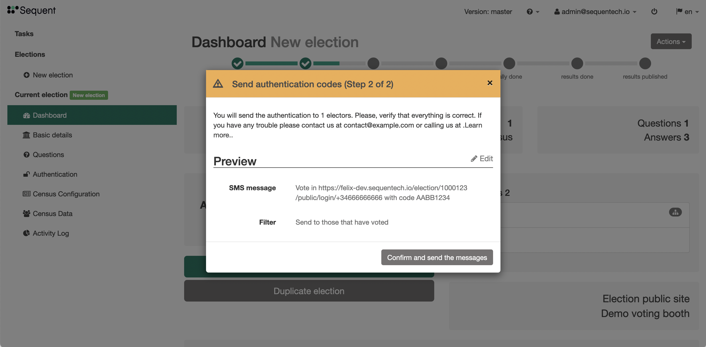

# Messaging Voters Guide

You can send custom messages to voters at any time during the electoral process.  These
messages can be sent in bulk from the Election Dashboard and to specific voters from the 
Election's Census Data section. You can use these messages to send authentication codes
for elections that require it, or to send communications announcing the different stages
of the election.

Those messages will be sent through sms or email depending on the authentication 
method. Each voter will receive a tailored message with the template variables replaced
with their values. You can choose the message sending method (sms or email) if both are
available for that election.

## Template variables

Templates are text messages that include template variables. Each voter will receive a
tailored message with the template variables replaced with their values. Depending on
the authentication method, the message will be delivered as an email or as an SMS.

For authentication methods such as `email`, `email-otp`, or `email-and-password` the
message will be an email. In those cases, the email title and email text body are
templates. If [html messages](../../reference/election-creation-json#census-config-html_message)
are enabled in the deployment, the HTML message is also a template. For authentication
methods such as `sms` or `sms-otp`, the SMS text body is a template. Furthermore, you can also use an
[extra field](../../reference/election-creation-json#census-extra_fields) of type `otp-code`
to send authentication messages for any authentication method.

In templates, variables are identified surrounded by two `_` characters and always
in upper case. For example the variable `url` would appear as `__URL__`.

The allowed template variables are:
- `__URL__`: This is the voter authentication URL specific for the voter but
not containing the voter authentication code, which the voter will have to fill
out manually.
- `__URL2__`: This is the voter authentication URL containing the 
both the email/sms of the voter and the voter authentication code. If no other
[extra_field](../../reference/election-creation-json#census-extra_fields) is required during authentication, entering  
in the `__URL2__` URLs allows voters to authenticate without having to fill out 
any web form. It's easier, but also more risky because anyone with this link 
could use it to authenticate.
- `__URL_<alt-auth-method-id>__` and `__URL2_<alt-auth-method-id>__` if you are using [`alternative_auth_methods`](../../reference/election-creation-json/#census-alternative_auth_methods), with the `alt-auth-method-id`
[sluggified](https://docs.djangoproject.com/en/3.1/ref/utils/#django.utils.text.slugify).
- `__CODE__`: This is the authentication code. By default each time the
authentication codes are sent to a voter, a new code is generated and any old
codes are disabled. Alternatively, the code might be fixed / static if the
[`fixed-code` is set to `true`](../../reference/election-creation-json#census-config-fixed-code).
- `__OTL__`: Includes a One Time Link (OTL). This OTL accesses to an
authentication process that, once authenticated, shows the authentication code
to voters. Only works if
[`support_otl_enabled`](../../reference/election-creation-json#support_otl_enabled)
is enabled.
- `__<extra_field>__`: Each voter has some voter related information 
associated to it. You can use those extra fields by the 
[sluggified](https://docs.djangoproject.com/en/3.1/ref/utils/#django.utils.text.slugify) 
and uppercased [name](../../reference/election-creation-json#extra-field-name) property.

:::note
Even if the template message does not contain __URL2__ nor __CODE__, a new code
will be generated.
:::

The maximum length of the message text depends on the authentication method. By
default the email text body can have up to `5,000` characters, and SMS text
body can only have `200`. To change this, you would need to change the code
in the respective authentication method code. 
[This is the relevant code](https://github.com/sequentech/iam/blob/e9e980f8afd07e32098c487b7a8c3a9b4c5d575a/iam/authmethods/m_email.py#L140) 
in the `email` authentication method.

## Sending bulk messages

### Sending SMS

You can send bulk messages to voters from the election dashboard. In the election 
Dashboard, click on the `Send auth codes` button:

This will open a modal. In this case the election authentication mode is `sms`, thus
the template is the SMS message, where you can use template variables in the form of
`__<variable>__`. You can also filter the census to send the message only to those that
have already voted, or to those that haven't voted yet. When you're ready, click on the
button at the bottom to review the configuration.

The next screen shows a preview of the configuration you have selected, by replacing the 
template variables, and showing the chosen filter configuration. This allows you to 
review the configuration before sending the messages. This modal also informs you of the
number of recipients of the message you will be sending. If you want to modify the message,
click on the `Edit` button at the right to go back to the previous screen. If everything
is OK, click on the button at the bottom `Confirm and send the messages`. The modal will
close and a green box will confirm the messages were successfully sent.

### Sending Emails

You can send bulk emails to voters on elections where the authentication method uses the email.
Go to the election Dashboard and click on `Send auth codes`.

This modal is similar to the one for SMS messages. In this case the required template fields
are the email title and the email text body. If it's enabled, you can also configure the [HTML
email body](../../reference/election-creation-json#census-config-html_message). You can also
choose to send the emails only to voters that have already voted, or to those that haven't voted
yet. Once you click on the button at the bottom you'll see a preview of the message.

The second modal step shows a preview of the configuration you have selected, by replacing the 
template variables, showing the chosen filter configuration, and a rendered version of the HTML
message. Click on the `Edit` button to modify the configuration or click on `Send auth codes`
to send the emails.

 ## Sending messages to specific users

Instead of sending messages in bulk, you can send them to specific voters. Go to the
`Census Data` section. Click on the checkboxes on the left side and click on the `Actions`
button on the top right, and then `Send auth codes to <n> selected..`. A modal will appear.
The modal is very similar to the one previously shown.

 

