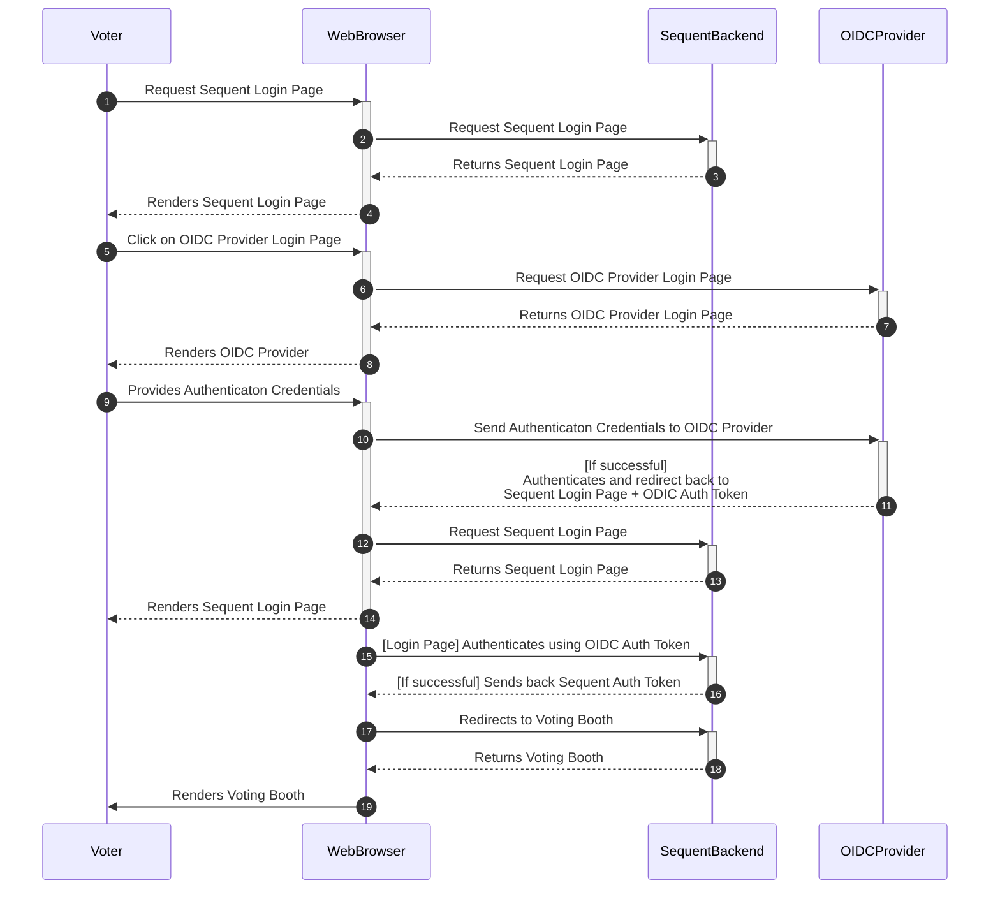

## Introduction

In this document we will explain everything you need to know about the OpenID
Connect authentication mechanism: what it is, what it provides, how it works,
and how to use it.

## What it is

OpenID Connect (OIDC) is an authentication method supported by the Sequent
Platform that works on top of the OAuth 2.0 framework. OIDC allows voters to use
single sign-on (SSO) to authenticate using 3rd-party OpenID Providers (OPs),
such as an email provider or social network, to authenticate their identities.

:::note Other Single sign-one methods

Sequent Platform also supports the 
[SmartLink authentication method](../smart-link-auth/)  to implement Single
Sign-On.
:::

## How it works

SmartLink is a native authentication method in Sequent platform. Voters will be
sent from the Login page to a third-party OpenID Provider (OP), and
authenticated there. Please note that still, **authorization is done by**
**Sequent platform**. This means that the administrator need to upload the
census in Sequent platform.

The authentication flow compromises the following steps:
1. Voters access the Login page.
2. In the login page, the voter click in one of the OPs configured for the
   election and listed in the login page.
2. After clicking on the OP link, the voter is redirected to an external website
   provided by the OP, where the voter can authenticate.
3. Once authenticated in the external website of the OP, the voter is redirected
   back to a callback Sequent Platform URL.
4. Sequent Platform receives some authentication token from the OP, which it 
   uses to verify the voter identity. If the voter `sub` from this token is part
   of the election census, the voter authorization verification is successful
   and the voter is redirected to the Voting Booth.

This is more detailed in the Sequent OIDC Sequence diagram:



## How to use OIDC

### 1. Configure Deployment OIDC Providers

For security reasons, available OIDC Providers (OP) need to be configured at the 
deployment. You can configure multiple OPs in a deployment, and then use one(s)
you want for each election.

Each OP has different ways to configure their deployment and how to do that is
out of the scope of this guide. We'll use Google as our example OIDC provider.
You can read [here about how to setup OIDC support in Google](https://developers.google.com/identity/openid-connect/openid-connect?hl=en).

Once you are done, you will have to edit the `config.yml` deployment
configuration file and edit the `config.iam.openid_connect_providers` key, which
is `[]` (an empty list) by default. The configuration for Google will be similar
to the one below, but with a different value for the keys `client_id` and
`client_secret`, and of course you can also change at will the `id`, `title`,
`description` and `icon` parameters:

```yaml
---
    # List of OpenID Connect providers information. Each provider contains
    # public info that is used by sequent-ui to show information about the
    # providers, and private info that is used by iam for authentication.
    #
    # The logout_redirect_uri is used in case the election is configured to
    # show a way to logout or even redirect after voting, and this URI can
    # contain a __EVENT_ID__ that will be changed to the appropiate event_id
    # before sending the user to it.
    openid_connect_providers:
     - public_info:
         id: google
         title: Authenticate to vote with Google
         description: Authenticate to vote with Google
         icon: https://www.google.com/favicon.ico
         authorization_endpoint: https://accounts.google.com/o/oauth2/v2/auth
         client_id: <CLIENT_ID>.apps.googleusercontent.com
         issuer: https://accounts.google.com
         token_endpoint: https://oauth2.googleapis.com/token
         jwks_uri: https://www.googleapis.com/oauth2/v3/certs
         logout_uri: https://accounts.google.com/o/oauth2/v2/auth_logout
       private_config:
         client_secret: <CLIENT_SECRET>
```

After redeploying with the updated `config.yml` file, you will have successfully
configured the OIDC Providers available in your deployment.

### 2. Create an election with OIDC authentication

You can download an
[example OIDC election configuration](./assets/oidc-election.json.yaml) and
import it in the Admin Portal.

To add support for OIDC, we need to:
- Set the `auth_method` to `openid-connect`.
- Have an an [extra_field](../../reference/election-creation-json.md#census-extra_fields)
  of type `text` and named `sub`. The `sub` field is the user identifier that
  will be authenticated by the OIDC Provider. Typically, it's the user's email
  address, but it could be any other identifier. It needs to be unique and it is
  a required field.

Something like what you can see below:

```json  title="oidc-election.json fragment"
{
   "id": -1,
   "title": "OIDC Test Election",
   "census": {
      "auth_method": "email",
      "extra_fields": [
         {
            "name": "sub",
            "type": "text",
            "required": true,
            "min": 1,
            "max": 255,
            "unique": true,
            "required_on_authentication": true
         }
      ]
   }
// ... rest of the configution ....
}
```
