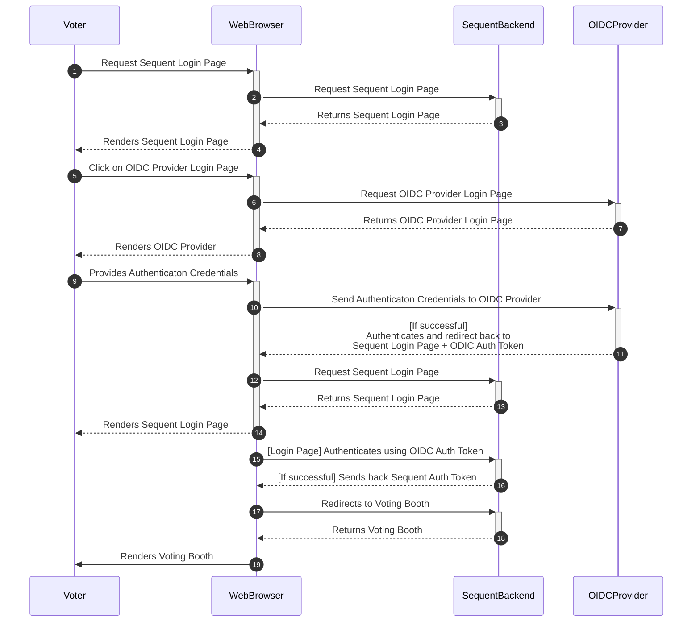
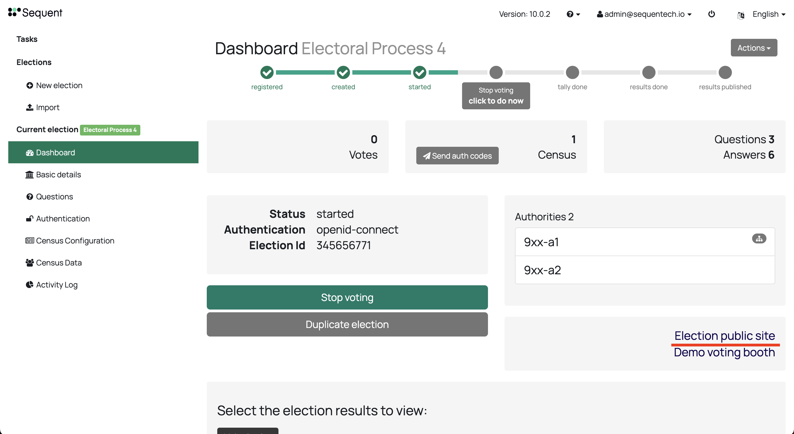
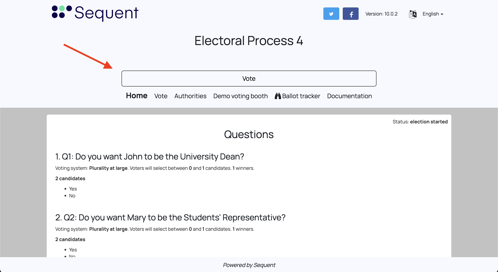
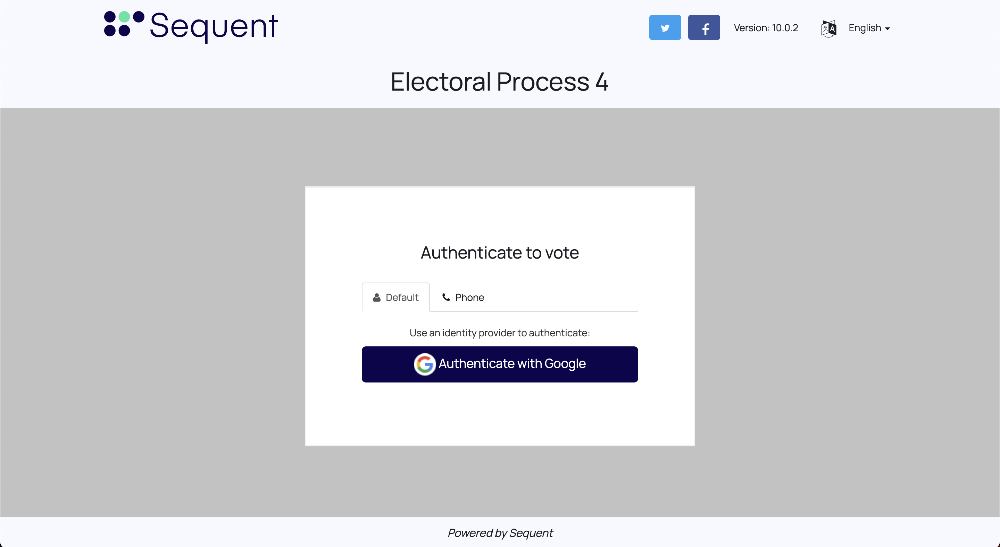
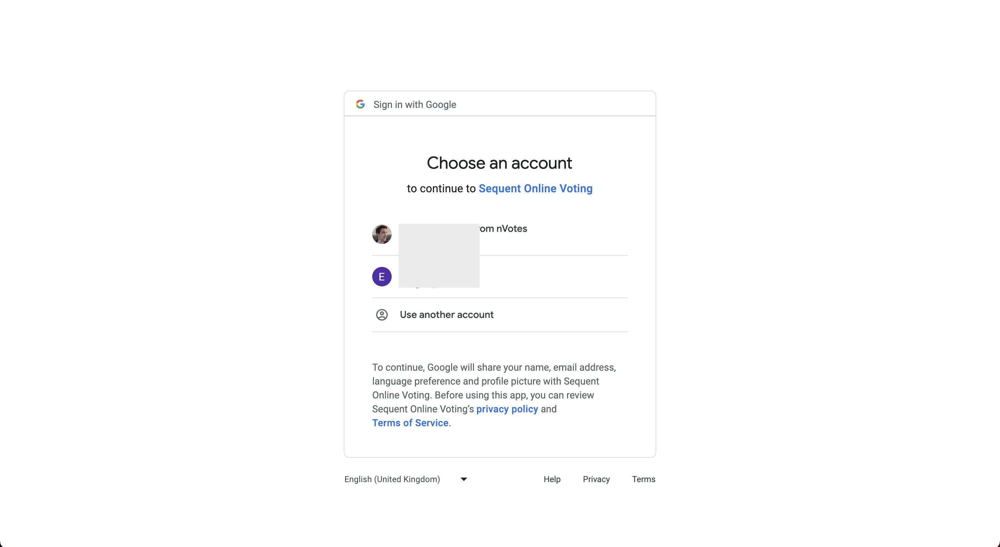
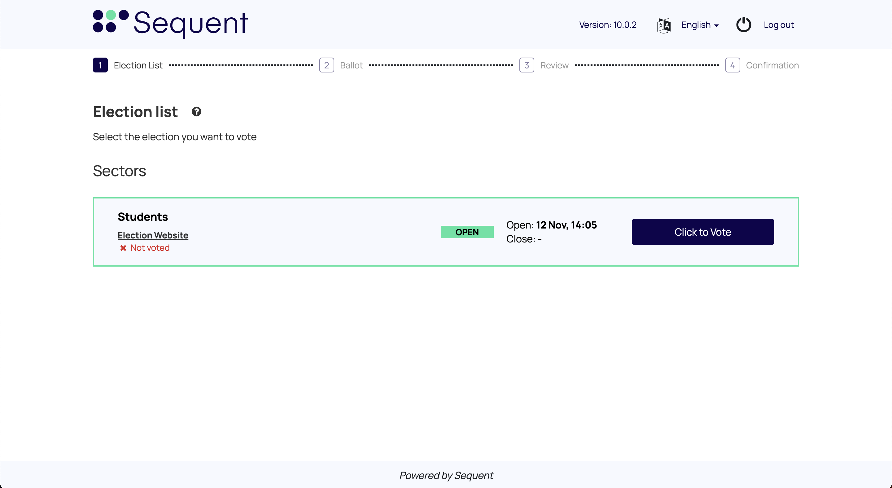
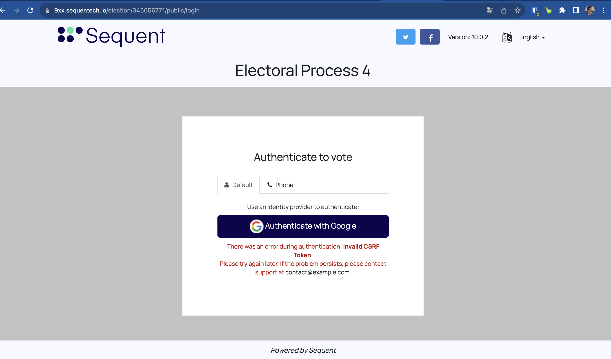

## Introduction

In this document we will explain everything you need to know about the OpenID
Connect authentication mechanism: what it is, what it provides, how it works
and how to use it.

## What it is

OpenID Connect (OIDC) is an authentication method supported by the Sequent
Platform that works on top of the OAuth 2.0 framework. OIDC allows voters to use
single sign-on (SSO) to authenticate using 3rd-party OpenID Providers (OPs),
such as an email provider or social network, to authenticate their identities.

:::note Other Single sign-one methods

Sequent Platform also supports the 
[SmartLink authentication method](../smart-link-auth/)  to implement Single
Sign-On.
:::

## How it works

SmartLink is a native authentication method in Sequent platform. Voters will be
sent from the Login page to a third-party OpenID Provider (OP), and
authenticated there. Please note that still, **authorization is done by**
**Sequent platform**. This means that the administrator need to upload the
census in Sequent platform, unless using an [Open Census](../../reference/election-creation-json#census-census) setting.

The authentication flow compromises the following steps:
1. Voters access the Login page.
2. In the login page, the voter click in one of the OPs configured for the
   election and listed in the login page.
2. After clicking on the OP link, the voter is redirected to an external website
   provided by the OP, where the voter can authenticate.
3. Once authenticated in the external website of the OP, the voter is redirected
   back to a callback Sequent Platform URL.
4. Sequent Platform receives some authentication token from the OP, which it
   uses to verify the voter identity. If the voter's identity claim from this
   token is part of the election census, the voter authorization verification is
   successful and the voter is redirected to the Voting Booth.

This is more detailed in the Sequent OIDC Sequence diagram:



With respect to OIDC, we use the **Server Flow**, that is detailed by Google's
[OIDC documentation](https://developers.google.com/identity/openid-connect/openid-connect#server-flow). 
This includes the creation and later the verification of a anti-forgery state
token (Cross-Site Request Forgery token or CSRF token).

## How to use OIDC

### 1. Create an election with OIDC authentication

You can download an
[example OIDC election configuration](./assets/oidc-election.json.yaml) and
import it in the Admin Portal. You'll have to change the `oidc_providers` and
the trustees to make it work with your deployment, though.

To create an election OIDC authentication, we need to:
- Set the `auth_method` to `openid-connect`.
- Have an an [extra_field](../../reference/election-creation-json.md#census-extra_fields)
  named `sub`. The `sub` field is the user identifier that
  will be authenticated by the OIDC Provider. Typically, it's the user's email
  address, but it could be any other identifier. It needs to be unique and it is
  a required field. Note that the extra field can be of any appropriate type,
  in this example it would of of type `email`.
- Use the `source_claim` attribute for the `sub` extra_field - or any other - to
  populate authentication data from signed & verified id_token claims. For
  example, in google's case the id_token contains the `email` claim. 
  [More info about Google available claims here](https://developers.google.com/identity/openid-connect/openid-connect#an-id-tokens-payload).
- Configure available OIDC Providers (OP) in the `census.oidc_providers`
  parameter of the election. You can configure multiple OPs, and then use the
  `census.config.provider_ids` setting to show them in order.

  The OP should be configured to request a specific scope using the `scope`
  parameter. For example, in Google's case if you want to obtain the `email`
  claim as mentioned earlier, you need to request `openid email` scope as
  [explained in Google OIDC documentation](https://developers.google.com/identity/openid-connect/openid-connect#sendauthrequest).

  Also, this makes the parameters compatible with 
  [alternative auth methods](../../reference/election-creation-json#census-alternative_auth_methods),
  since you can set the `census.oidc_providers` at the auth event level, and
  configure the `openid-connect` auth method as an alternative authentication
  method whose configuration refers to these providers.

Each OP has different ways to configure their deployment and how to do that is
out of the scope of this guide. We'll use Google as our example OIDC provider.
You can read [here about how to setup OIDC support in Google](https://developers.google.com/identity/openid-connect/openid-connect?hl=en).

The configuration of an election with Google as a provider will be similar to
the one below, but with a different value for the keys `client_id` and
`client_secret`, and of course you can also change at will the `id`, `title`,
`description` and `icon` parameters.

Something like what you can see below:

```json  title="oidc-election.json fragment"
{
   "id": -1,
   "title": "OIDC Test Election",
   "census": {
      "auth_method": "email",
      "extra_fields": [
         {
            "name": "sub",
            "type": "email",
            "required": true,
            "source_claim": "email",
            "min": 1,
            "max": 255,
            "unique": true,
            "required_on_authentication": true
         }
      ],
      "oidc_providers": [
         {
            "public_info": {
               "id": "google",
               "title": "Authenticate with Google",
               "description": "Authenticate with Google",
               "icon": "https://www.google.com/favicon.ico",
               "authorization_endpoint": "https://accounts.google.com/o/oauth2/v2/auth",
               "client_id": "<CLIENT_ID>.apps.googleusercontent.com",
               "issuer": "https://accounts.google.com",
               "scope": "openid email",
               "token_endpoint": "https://oauth2.googleapis.com/token",
               "jwks_uri": "https://www.googleapis.com/oauth2/v3/certs",
               "logout_uri": "https://accounts.google.com/o/oauth2/v2/auth_logout"
            },
            "private_info": {
               "client_secret": "<CLIENT_SECRET>"
            }
         }
      ],
      "config": {
         "provider_ids": ["google"],
         "authentication-action": {
            "mode": "vote",
            "mode-config": {
               "url": ""
            }
         },
         "registration-action": {
            "mode": "vote",
            "mode-config": null
         }
      }
   },
// ... rest of the configution ....
}
```

### 2. Authenticate as a voter

To authenticate, you first need to:
- Ensure the user is part of the census
- Start the voting period

Once done that, you can enter the Election Public Site clicking on it on the
election's dashboard:



Click in the Vote button in order to show the login page:



Which would show the Voter's Login page (in the example shown in the image
below, we also habilitated an [alternative authentication method](../../reference/election-creation-json#census-alternative_auth_methods)
using SMS authentication):



If you click on the `Authenticate with Google` button, you would be redirected
to Google OIDC authentication page:



Finally, you will be redirect back from the OIDC Provider to Sequent's platform.
Sequent Platform will transparently verify the identity data from the OIDC
Provider, verify the authorization of the authenticated voter, and if everything
checks out, the voter will be shown the Voting Booth as an authenticated voter.

Below you can see the Voting Booth of an authenticated voter. In this case, it's
a Parent-children election so the voter is being shown the children election in
which the voter has authorization to vote:



If for some reason the authentication fails, the voter would be redirected to
the login screen, and shown an error message:


