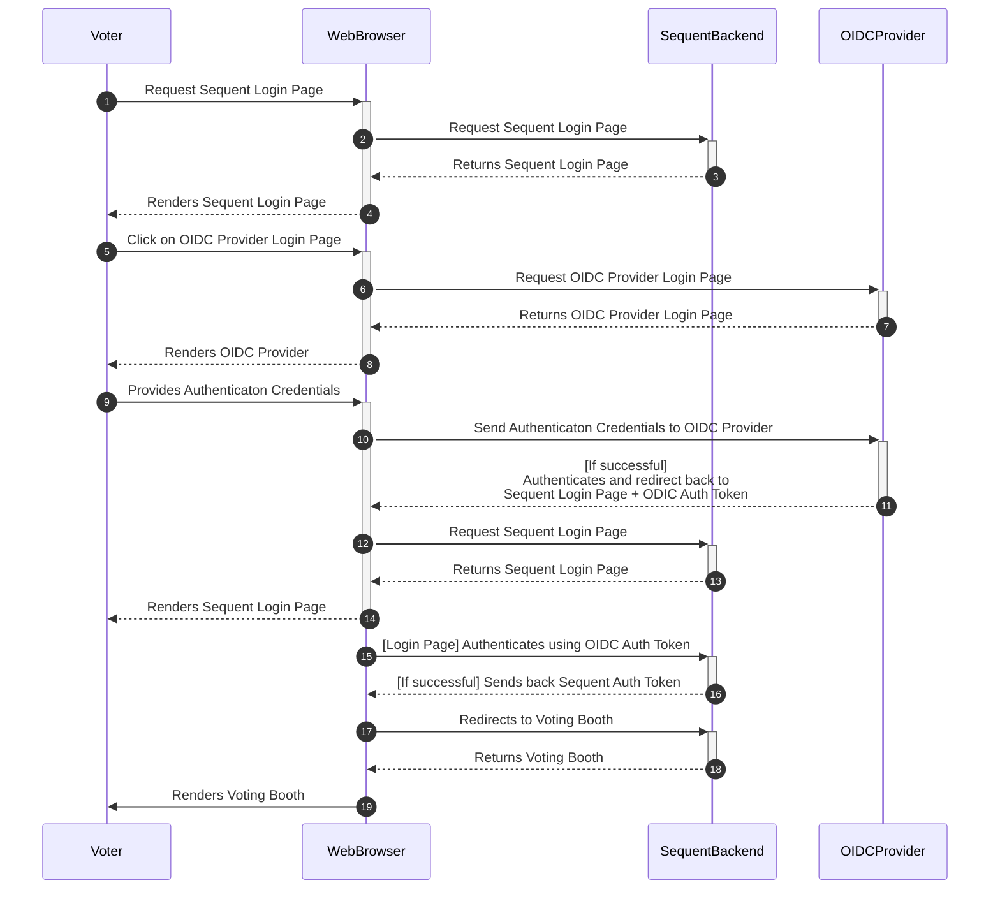

## Introduction

In this document we will explain everything you need to know about the OpenID
Connect authentication mechanism: what it is, what it provides, how it works,
and how to use it.

## What it is

OpenID Connect (OIDC) is an authentication method supported by the Sequent
Platform that works on top of the OAuth 2.0 framework. OIDC allows voters to use
single sign-on (SSO) to authenticate using 3rd-party OpenID Providers (OPs),
such as an email provider or social network, to authenticate their identities.

:::note Other Single sign-one methods

Sequent Platform also supports the 
[SmartLink authentication method](../smart-link-auth/)  to implement Single
Sign-On.
:::

## How it works

SmartLink is a native authentication method in Sequent platform. Voters will be
sent from the Login page to a third-party OpenID Provider (OP), and
authenticated there. Please note that still, **authorization is done by**
**Sequent platform**. This means that the administrator need to upload the
census in Sequent platform.

The authentication flow compromises the following steps:
1. Voters access the Login page.
2. In the login page, the voter click in one of the OPs configured for the
   election and listed in the login page.
2. After clicking on the OP link, the voter is redirected to an external website
   provided by the OP, where the voter can authenticate.
3. Once authenticated in the external website of the OP, the voter is redirected
   back to a callback Sequent Platform URL.
4. Sequent Platform receives some authentication token from the OP, which it 
   uses to verify the voter identity. If the voter `sub` from this token is part
   of the election census, the voter authorization verification is successful
   and the voter is redirected to the Voting Booth.

This is more detailed in the Sequent OIDC Sequence diagram:

