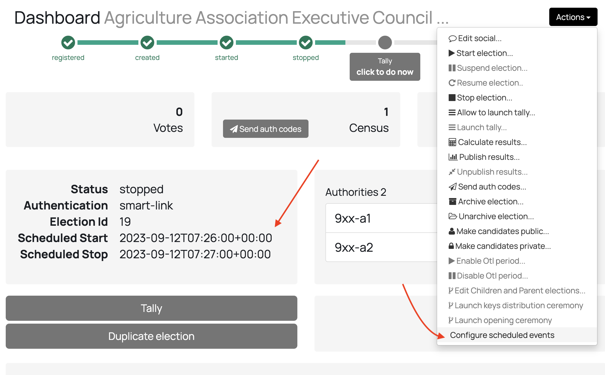
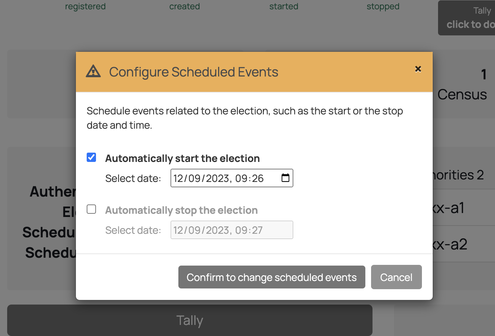
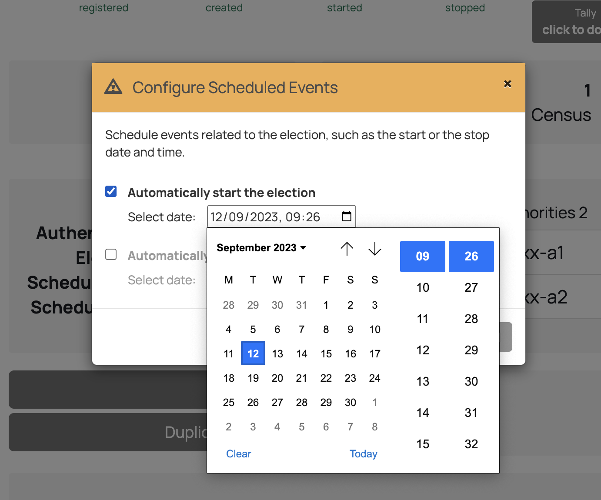
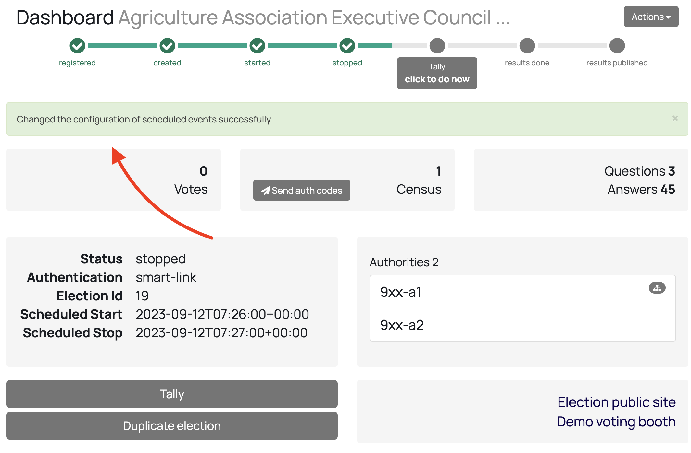
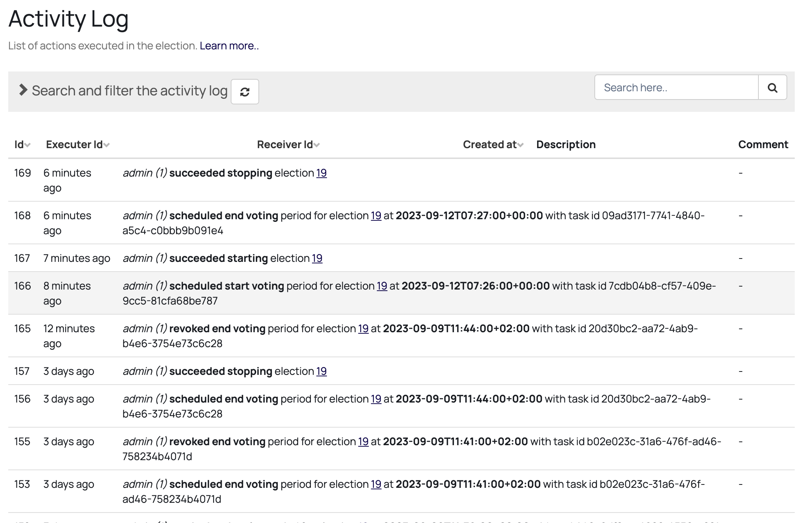

# Scheduled Events Guide

You can automate events such as the start and the stop date time of an election
with scheduled events. These automations are not final, and you can change the
datetimes or even remove the automated datetime at any time. Of course, all 
these changes will be reflected in the activity log of the election and these
important dates appear in the election dashboard.

## Technical Implementation

Scheduled events are setup with django [celery]. A task is created in celery to
be run at a specific date and time. This task is persisted using [rabbitmq].

The scheduled events can be re-scheduled and even cancelled as you will see in
later sections. Since we store the task id for each scheduled event within the
AuthEvent model, we can revoke any previously scheduled task when re-scheduling
or cancelling an event.

Once the task is called at the scheduled time, it will be executed and the
election start or stop will thus happen **just moments after** the scheduled
time - typically less than a second. But that also depends on the number of
children events, which can take a while more since each child election is
started/stopped separatedly.

## Election JSON Configuration

You can configure the scheduled events in the Election Configuration JSON using
the [`scheduled_events`](../../reference/election-creation-json#election-scheduled_events)
field:

```json
{
    // ... rest of the election configuration...
    "scheduled_events": {
        "start_voting": {
            "event_at": "2023-09-12T09:26:00+00:00"
        },
        "end_voting": {
            "event_at": "2023-09-13T09:26:00+00:00"
        }
    },
    // ... rest of the election configuration...
}
```

## Scheduled events in the Election Dashboard

The configuration of scheduled events appears in the election dashboard. On the
one hand, if there's any scheduled start or end of the voting period, it will
appear highlighted.

On the other hand, at any time you can change and reconfigure the scheduled
events from the Dashboard `Actions` dropdown menu.

Both are being highlighted by red arrows in the following image:



## Configure Scheduled events: modal dialog

Once you click in the Election Dashbaord `Actions` > 
`Configure scheduled events` dropdown menu item, a modal dialog will appear in 
which you can configure the dates in which the election will be automatically
started or stopped of the election. This dialog can be launched at any time,
allowing you to reschedule or even cancel a previously schedule election start
or stop. To cancel an event, just click to uncheck the checkbox.





Once you click in the `Confirm to change scheduled events` button, the dialog
will close and a notification will appear in the top of the screen saying the
configuration was successful:



Additionally, the configuration box that shows the Election Status and some 
other election information will be automatically updated showing the updated
`Scheduled Start` and/or `Scheduled Stop` dates. This might take a few seconds
to appear since it is updated using polling.

Please notice that even though the datetime selector uses the browser's local
timezone, the dialog converts it to UTC timezone and thus scheduled events
datetime are thus shown in UTC if configured using the modal dialog.

## Configure Scheduled events: dashboard and activity log

When an scheduled event such as the end of the voting period happens, the
election status changes appropriately automatically. For example, the election
status of the election might change from `started` to `stopped`. If you have the
election dashboard open in your browser, it will take a few seconds to refresh
this information automatically. 

Additionally, all and any change of election scheduled events configuration or
change of status by the execution of the task related to an scheduled event will
appear in the election's activity log screen:



Note this screnshot shows:
1. That there are different scheduled events configuration changes being logged,
including the revokation of tasks related to previously scheduled events.
2. The successful execution of any scheduled event, in relation to the user
that scheduled such execution.
3. With any scheduled task or revokation of task, the associated task id is 
being logged.
--
[celery]: https://docs.celeryq.dev/en/stable/index.html
[rabbitmq]: https://www.rabbitmq.com/documentation.html