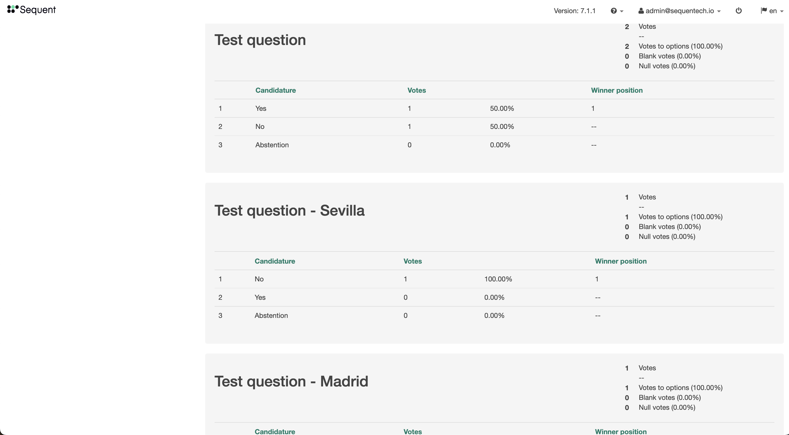

## Introduction and rationale

Segmented Mixing allows to speed up election creation and tallying for electoral
processes where you need segmented votes during tallying but the questions being
voted are exactly the same in all these segments.

The alternative to segmented mixing is using
[Parent-Children Elections](../parent-and-children-elections/) with one child
election per segment. However, since you need one election per segment and 
elections are tallied sequentially and have a minimum tally (or key-creation)
time of around 30 seconds per question in each election, this can slow-down
the election creation and the tally time.

In contrast, with segmented mixing you only need one election. If you have 30
segments (for example provinces), one election with 2 questions and need a tally
segmented by province, then a segmented election creation and election tally
will take only ~1 minute instead of the 30 minutes it would take for each of
those processes with parent-children elections. 

:::note
[Parent-Children Elections](../parent-and-children-elections/) election is a 
more generic and powerful mechanism. Use Segmented mixing only when appropriate.
:::

Segmented mixing works by performing a single mix while allowing to
group/segment the resulting anonymized ballots because they have been tagged
before performing the tally.

## How does it work

Segmented mixing works works as follows:

1. Each voter has an attribute in the census marking its segmentation. This
   could be the region of the voter, its category, or any other segmentation
   variable.
2. Before sending the encrypted ballots to the mixnet for shuffling and
   decryption, the ballots are tagged with a different tag per segment.
3. Once the votes are shuffled and decrypted by the mixnet, the raw encoded
   ballots are decoded and converted into
   `(encoded-ballot) -> (region, original-ballot)`.
4. The ballots are tallied grouped per segment and also showing a consolidated
   result.

## Implementation details

The encrypted ballots can be tagged by taking advantage of the homomorphic
properties of ElGamal encryption, by which we can multiply an encrypted ballot
with another encrypted text of a specific number different for each group (the
tag) and obtain a verifiably encrypted text that contains the result of that
multiplication.

A encoded plaintext ballot is just an integer number. For example `2` may encode
a vote for `Yes` and `4` may be a vote for `No` in a contest. Take a look at
[Ballot Encoding](../../reference/ballot-encoding.md) for more details of how
we encode a ballot into a positive integer within Sequent's Voting Platform.

ElGamal cryptosystem receives any integer number and produces a ciphertext.
An intermediate step before applying ElGamal encryption is to encode this
integer plaintext into a multiplicative subgroup `Gq` using the set of quadratic
residues modulo `p`. This is required to achieve semantic security. There is a
post in Sequent's blog detailing this process of
[Elgamal Plaintext encoding](https://sequentech.io/plaintext-encoding-in-elgamal/).

### Encoding and decoding segmentation

Segmentation is performed in the dumping of the ballot box to the mixnet. We
take each encrypted ballot `E(ballot)` and multiply with an encrypted category
tag `E(tag)` resulting in an ciphertext `E(ballot * tag)`. This means that when
decrypted, the decryption of such ciphertext will be `ballot * tag`.

For example, if `ballot = 4` (a vote for `No`) and `tag = 11` (category
`Madrid`), then `ballot * tag = 4 * 11 = 44`. The mixnet will receive `E(ballot*tag) = E(44)` for this ballot instead of `E(ballot) = E(4)`, and the anonymized plaintext of the
ballot, which is part of the mixnet's output, will be `44` instead of `4`.

Before the tally process can begin, we need to convert back this `44` into `4`,
because otherwise this would be counted as an invalid ballot. At the same time,
we need to detect which category does this ballot belong to, to count it only
for that category.

Categories are encoded as prime numbers, like `11` for `category = Madrid`.
Thus, decoding segmentation is as simple as detecting by which category prime is
the segmentation-encoded ballot dividable by. `44` is dividable by `11`, so we
detect that it is inside the `Madrid` category, and decoding the
segmentation-encoded ballot is as easy as performing `44 / 11 = 4`. We have
obtained back our ballot plaintext.

### Categories encoding

As mentioned before, each category tag is encoded as a prime number: the
**category prime**. But it has some other constraints - it cannot be any prime
number. For example, the number `3` is prime, but maybe it also could encode a
valid ballot, and this could create ambiguous situations in which someone who
voted by encoding the ballot `3` and whose category prime is `5`, would be
instead assigned the category `3` and the decoded ballot `5`.

For the reason above, a category prime needs to be always bigger than the
highest encodable ballot. Additionally, the category prime needs to comply with
being an integer number of the multiplicative subgroup `Gq` by ensuring the
prime is a quadratic residue modulo `p`, as mentioned earlier.

When creating an segmented election, an ordered list possible categories is set.
An algorithm calculates the `category primes`, in the given order, assigning a
prime number for each category tag by simply using the next available integer
that complies with the requirements mentioned:
1. The number is higher than the maximum encodable ballot.
2. The number is not in use by any previously calculated category prime.
3. The number is prime.
4. The number is a quadratic residue modulo `p`.

### Producing a segmented tally

During tallying, the segmentation-encoded plaintext ballots are decoded as
described in the previous section. However, The whole purpose of the
segmentation is to produce segmented election results.

The [software module doing the tally](https://github.com/sequentech/tally-pipes/)
detects when an election is segmented, and for each question it duplicates the
question one time per [segment](../../reference/election-creation-json.md#election-mixingCategorySegmentation), and also produce a question with the
aggregated results of all the posible segments.

This works in a similar manner to the [University elections example](../parent-and-children-elections/#university-elections-example) of the Parent and
Children Elections Guide, but in an automatic manner. For example if we have
only one question `Question 1: What's your favorite color?`, and we have two
segments `Madrid` and `Sevilla`, the election results will contain the following
three questions:

1. Question 1: `What's your favorite color?`, containing the results for all
   segments.
2. Question 2: `What's your favorite color? - Madrid`, containing the results
   for `Madrid` segment of voters.
3. Question 3: `What's your favorite color? - Sevilla`, containing the results
   for `Sevilla` segment of voters.

## Risks and limitations

Segmentation mixing is an advanced feature and has some known risks and
limitations. Most importantly, a malicious voter could be able to craft a vote
in such a manner that this vote will be included in the wrong segmentation
category. However, it's guaranteed by the way segmentation is implemented that
in this scenario the ballot would always be deemed invalid.

Please take the mentioned risks into account before using this feature.

## How to use it

You need to create an election with:
- [`election.segmentedMixing`](../../reference/election-creation-json#election-segmentedmixing) set to `true`
- [`election.mixingCategorySegmentation`](../../reference/election-creation-json#election-mixingCategorySegmentation)
  properly configured (see the documentation).
- Have an extra field in the census matching the
  `election.mixingcategorySegmentation.categoryName`.

You can find an example election in
[segmented_election.json](./assets/segmented_election.json.yaml). Here are the
highlights:

```json title="segmented_election.json fragment"
{
   "title": "Segmented election",
   "segmentedMixing": true,
   "mixingCategorySegmentation": {
      "categoryName": "province",
      "categories": [
         "Sevilla",
         "Madrid"
      ]
   },
   "census": {
      "auth_method": "email",
      "extra_fields": [
        {
          "must": true,
          "name": "province",
          "type": "text",
          "required": true,
          "private": true,
          "min": 1,
          "max": 255,
          "required_on_authentication": false
        }
      ],

... rest of the configution ....
```

Once created the election, it works exactly as a non-segmented election for
voters and administrators, except on the election results. Here is how the
electoral results look in the dashboard will look like the following:


