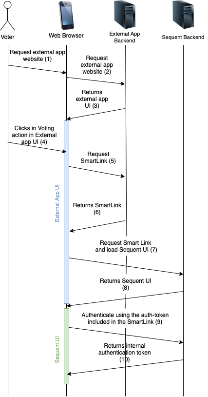
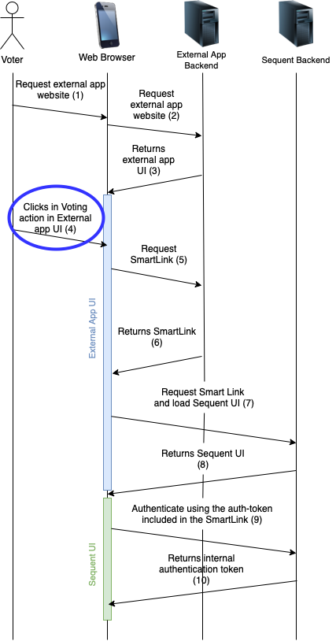
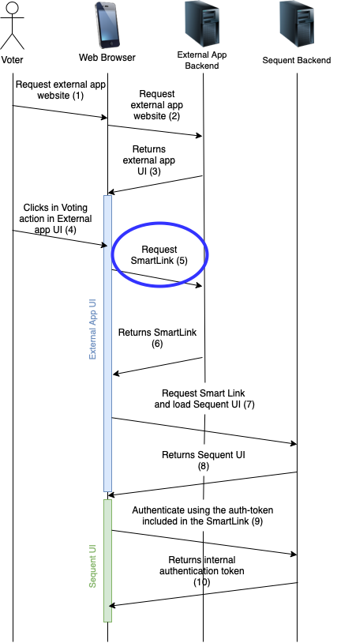
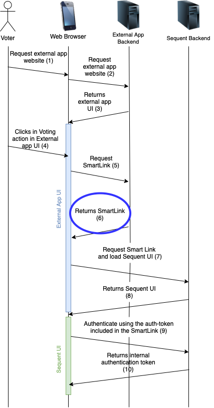
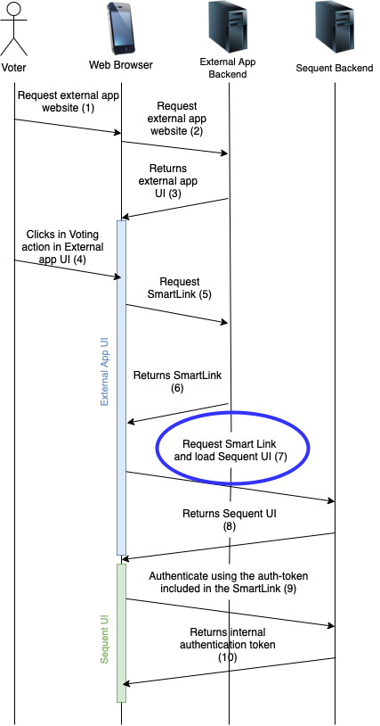
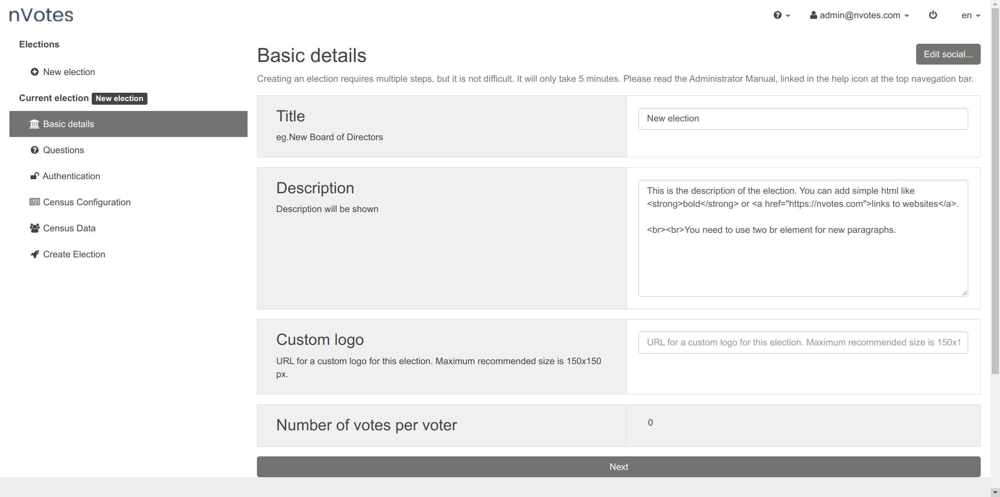
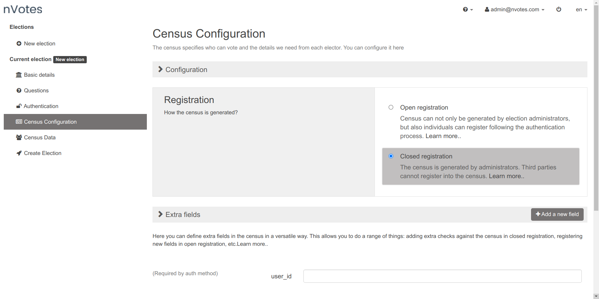
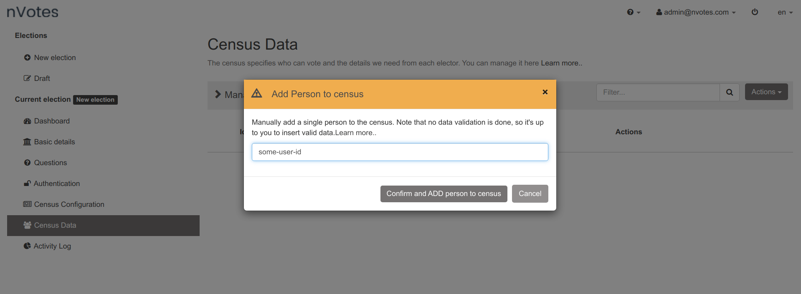
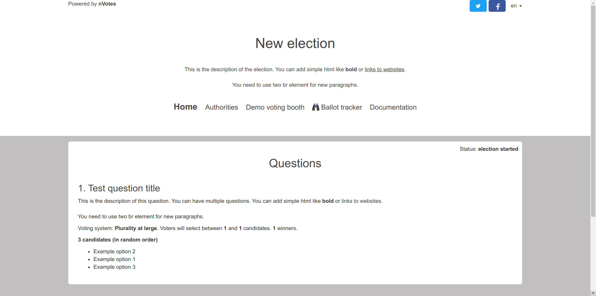
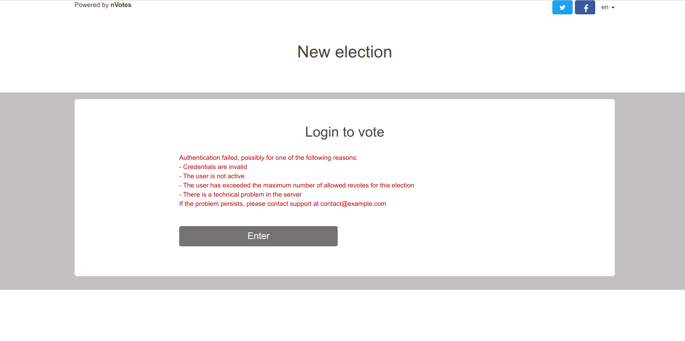

## Introduction

In this document we will explain everything you need to know about SmartLink 
authentication mechanism: what it is, what it provides, how it works, and how
to use it.

## What it is

SmartLink is a Single sign-on (SSO) authentication mechanism provided by the 
Sequent platform that uses a Keyed [HMAC](https://en.wikipedia.org/wiki/HMAC) 
authentication token. It allows you to send voters that 
are already authenticated  in your own platform or website to a voting link 
for a specific election without forcing them to authenticate again in Sequent 
Platform. It is a secure and simple way to implement Single sign-on.

:::note Other Single sign-one methods
Sequent Platform also supports the 
[OpenID Connect authentication method](../../reference/election-creation-json#census-auth_method) 
to implement Single sign-on.
:::

## How it works

SmartLink is a native authentication method in Sequent platform. Voters will be 
authenticated through a link that includes a secure authentication token (the 
`auth-token`), but  **authorization is done by Sequent platform**. This 
means that the administrator need to upload the census in Sequent platform.

The authentication flow compromises the following steps:
1. Voters are asumed to start by being already authenticated in your website or 
platform (the `external application`).
2. In the external application, voters launch the action to vote, and this 
redirects them to a SmartLink in Sequent Platform.
3. The Sequent platform loads the SmartLink, performing authentication and 
authorization and automatically redirecting to the voting booth when 
authentication and authorization succeed. 

:::note Automatic redirection to voting booth

There is the possibility of adding an additional step before the redirection to
voting booth happens, by configuring some extra fields that need to be validated
before the authentication is complete. This allows to effectively doubly
authenticate the user by both the `external application` and Sequent Platform.

Read more about that in [JSON Configuration](#json-configuration) section.
:::

A more detailed sequence diagram of the steps involved is shown below:

<div style={{textAlign: 'center'}}>



</div>

As can be seen in the sequence diagram, the single interaction of the voter
clicking in the action to Vote inside the External Application triggers a 
series of events that ends up loading Sequent User Interface (UI) with an 
internal authentication token. 

After the final step shown in the sequence diagram (number 10), Sequent UI will
automatically load the voting booth and the voter's vote will be correctly 
authenticated when cast.

### `auth-token` overview

The auth-token is generated in the external application, and verified by Sequent
platform. It is a cryptographically secure to transmit information between the 
external application and Sequent plataform.

The following data is securely transmitted through the auth-token:
- `user-id`: A unique identifier string of the voter. This is the way Sequent
platform matches the user with the previously census loaded in the election.
- `election-id`: The identifier of the election in which the voter will be 
authenticated in and in which he is eligible to participate.
- `timestamp`: Timestamp in which the token was generated. It allows the toke
to expire.

There are some other related data fields, but we will delve into the details 
later. 

All this data is signed by the usage of a keyed hash-based message 
authentication code (also called a keyed 
[HMAC](https://en.wikipedia.org/wiki/HMAC)). An HMAC is a cryptographic
mechanism that uses the fact that 
[hash functions](https://en.wikipedia.org/wiki/Hash_function) are 
[one-way functions](https://en.wikipedia.org/wiki/One-way_function) to use the
hashing as a secure signature mechanism. A one-way function is a function that
is easy to calculate in one direction, but very difficult or impossible to 
calculate in the opposite direction. Hash functions are one-way functions.

The external application will generate the message to be signed, then hash it
using the HMAC mechanism and the HMAC signature. The auth-token is 
composed by both the message and the HMAC code (or HMAC for short).

We use a keyed HMAC, which means that the hashing is of two things together:
1. The message
2. A shared secret, that only the external application and Sequent platform know.

Because hash functions are one-way functions, the resulting HMAC can only
be calculated having access to the hashed data. The HMAC serves as a 
signature because part of the hashed data (the shared secret) is secret. Sequent 
platform can authenticate that the message was generated by an authorized
party by receiving the authentication token, and calculating the HMAC by
using the message included in the auth-token with the shared secret. If
the resulting HMAC matches the hash included in the auth-token, then Sequent 
platform has successfully verified that the hash was generated by someone with 
access to the shared secret, which means the external application in our case.

The auth-token cannot be generated in the web-client of the
external application, because that would mean that the shared secret would be
accessible by the voter. The shared secret cannot be accessible by anyone else 
but Sequent Platform and the external application backend servers. The shared 
secret needs to  remain in the backend servers and not leave them. Of course, 
in Sequent platform the same principle applies, and only the backend servers can 
and do verify the auth-token.

## Integration

The steps 4 to 7 as shown in the sequence diagram from the 
[how it works section](#how-it-works), need to be implemented in the external
application.

### Step 4: Showing the vote action

<div style={{textAlign: 'center'}}>



</div>

At this step we start assuming the voter is correctly authenticated in the 
external application and the external application is being run in the voter's 
device.

The voter should be presented an action to be able to request to vote. This can
be a button or any other user interface representation. This action to vote MUST 
only be enabled during the voting period in which this specific voter can 
participate, and the action must be related to a specific election.

The Sequent platform assumes that the vote action will not be enabled once 
the voting is finished. If for some reason the action is activated when the
election is not within the voting period, the authentication will fail and the
voter will be redirected to the election public page.

In Sequent platform voters can in some cases vote multiple times, depending on the 
[election configuration](../../reference/election-creation-json##election-num_successful_logins_allowed). In any case, only the last vote cast by each voter will be counted. This is 
therefore not a security breach, but on the contrary a typical security measure 
in secure electronic voting systems to mitigate coercion, and we comment on it 
because it implies that in the cases where vote changing is allowed, the access
to the vote action should not disappear when the voter has voted. The reason is 
simple: the voter can change his/her vote by casting another vote during the 
voting period.

According to the above, it is not strictly necessary for the application to 
monitor whether the voter has already clicked on the vote button, or whether 
the voter has clicked on the vote button but has not finished voting, or whether
the voter has clicked on the vote button and has effectively cast the vote 
correctly. The external application can simply show the vote button whenever an
election is in progress.

In some cases, it is required that each voter can cast only one vote. As 
mentioned earlier, this is configurable in the election configuration. If this
is done and the voter has already voted, then when the voter accesses a second
time to the SmartLink it will show a generic authentication error message saying 
that the authentication did not succeed, mentioning multiple possible reasons 
why this error might happen.

Authentication error messages are explicitly vague for security reasons. Showing
different error messages might unintentionally reveal information to an 
attacker.

### Step 5: Requesting the SmartLink

<div style={{textAlign: 'center'}}>



</div>

When the voter clicks the vote action button, the external application should
request to the external application backend servers the SmartLink. The SmartLink
should:
1. Not be pre-generated or preloaded, as the SmartLink contains the auth-token
and the auth-token has a limited lifetime for security reasons related to it 
being a bearer token.
2. Should be generated in the backend and not in javascript in the web browser
of the voting device, because the generation of the SmartLink requires access
to the shared secret and the shared secret should not leave the backend servers.

The connection betweeen the external application user interface and the 
external application backend servers should be encrypted end-to-end, typically 
using TLS, so that the bearer token cannot be sniffed by any third-party 
attacker.

Of course, this request must be properly authenticated using whichever
authentication procedures that the external application uses internally.

### Step 6: Generating and returning the SmartLink

<div style={{textAlign: 'center'}}>



</div>

The external application backend servers receive the SmartLink generation 
request and need to safely process it, generate the SmartLink and return the 
SmartLink to the external application user interface.

First, the request needs to be validated and authenticated. Failing to correctly
verify the authentication of the request to generate the SmartLink would 
generate a security vulnerability, because an attacker could receive a 
SmartLink to vote in place of other voters. It's the responsability of the
external application to setup proper request authentication verification 
mechanisms.

Once the request is authenticated, then the application needs to
verify that voter is eligible to vote in the specific requested election and 
that this specific election is in the voting period. In Sequent platform, 
elections are identifed by the `election-id`, a positive integer that 
identifies the election.

#### The SmartLink format

The SmartLink is a string with the following pattern:

```
https://example.com/election/<election-id>/public/login?auth-token=<auth-token>
```

For example, if Sequent platform is deployed in the domain 
`vote.university.com`, and the election id is `150017`, the SmartLink for a
voter whose `user-id` is `example@sequentech.io` would look similar to the 
following:

```
https://vote.university.com/election/150017/public/login?auth-token=
khmac:///sha-256;8e0b1b553c29046cf5988a0e24d6ce276f6d14d27918da5d219
b634970c3f706/example@sequentech.io:AuthEvent:150017:vote:1620805691
```

For the same election, the only part that varies in each smart link is the
`auth-token`.

:::note Auth-token and URI encoding
The auth-token is provided as an URI parameter and thus needs to be encoded
properly. Usually, if you use characters like `a-zA-Z@:0-9` it's not going to
pose a problem. You don't need to actually process the auth-token as it will be 
automatically done by the web browser. It will just work out.

But if you are going to use some other characters, even a simple `+` or `%` 
character in the shared secret or in the user-id, you need to URI encode the 
auth-token. We **strongly recommend** always applying URI encoding of the 
auth-token just in case to avoid encoding issues in the  future.

A way to do this is using the 
[encodeURIComponent()](https://developer.mozilla.org/en-US/docs/Web/JavaScript/Reference/Global_Objects/encodeURIComponent) 
Javascript function. As the code that will redirect or load the SmartLink runs 
in the web browser, this function should be available for you to use. 

For manual testing purposes, you can use the 
[urlencoder.org](https://www.urlencoder.org/) website.
:::

#### The `auth-token` format

Please refer to the [auth-token overview](#auth-token-overview) section in which
we explain how the auth-token works.

The auth-token is a string that has the following format:

```
khmac:///sha-256;<code>/<message>
```

The code is generated by applying the HMAC function to the message plus the
shared secret. The code is generated with the standard HMAC procedure with the 
SHA-256 hashing function, further defined in the 
[U.S. Federal Information Processing Standards Publication 198](https://web.archive.org/web/20201208050119/http://csrc.nist.gov/publications/fips/fips198-1/FIPS-198-1_final.pdf). 

We provide two examples of how to generate the auth-token:
- [Auth-token generation in Rust language](https://play.rust-lang.org/?version=stable&mode=debug&edition=2018&gist=e369d1d1cc685bd2f88c9f0a9098865d)
- [Auth-token generation in Go language](https://play.golang.org/p/lp44mNTxfeu)

In other programming languages it is possible to generate the HMAC in a 
similar way, as it is a standard security mechanism.

#### The `auth-token` message format

The message is the string to be signed using the HMAC procedure. It has the 
following format:

```
<user-id: String>:AuthEvent:<election-id: Int>:vote:<timestamp: Int>
```

For example, a valid message could be:

```
example@sequentech.io:AuthEvent:150017:vote:1620927640
```

As can be seen there are three pieces of information within the message:
- **user-id** It is a text string used by Sequent Platform as an identifier of 
the voter. There are several important considerations with regards to the 
user-id:
  1. The user-id must always be the same for each voter on each election. That 
  is, if a voter votes twice in the same election, the user-id must be the same. 
  The user-id is the way Sequent Platform will find if the voter previously 
  voted, and in that way Sequent Platform decides whether to save the vote as a 
  new vote or overwrite the voter's previous vote.
  2. The user-id is the lookup field by which Sequent will try to find the voter
  in the census to perform authorization. If the user-id is not included in the 
  census of the election, authorization will fail. If the user-id is from 
  another voter, the voter would be voting in place of this other voter. Thus, 
  it's critical to correctly set this field.
  3. To avoid transmitting any additional information about the voter beyond a 
  unique identifier, the voter id can be a hash of a unique internal identifier 
  of the voter, known only to the external application. In this manner this 
  information does not have to transcend outside the external application. For 
  example, the affiliate number in an assocation or internal database unique 
  user id can be used.
  4. We recommend using SHA-256 as a hashing function, and avoiding SHA-1 or MD5 
  for security reasons.
  5. We recommend that you do not directly hash the voter's id, but rather hash 
  the id plus a salt. The salt must be another secret key, which is only known 
  by the external application servers, and thus protects against attacks that 
  reveal the voter's id.
  6. It is recommended that the salt varies for each election. That way in each 
  election the user-id for the same voter will be different, thus reducing the 
  information revealed through the user-id to Sequent platform strictly to the 
  minimum necessary. Therefore, it is recommended that you include the
  election-id in the salt to be hashed.
- **election-id** The unique identifier of the election. It is necessary to 
include it so that the message, which is trusted by Sequent platform because it 
is cryptographically signed, associates the user-id to a specific election, and 
thus the same message cannot be used for different elections in the event that
there are two or more elections running at once. The election-id will be 
provided by Sequent Platform for each election, and it will be a positive
integer.
- **timestamp** It is the date on which the message was generated, in 
"UNIX timestamp" format, that is, an integer with the number of seconds since 
January 1, 1970 ([more information](https://en.wikipedia.org/wiki/Unix_time)).
The message includes the timestamp as a way to calculate an expiration date 
for said authenticated message, as we have explained previously. The auth-token 
needs to expire because it is a bearer token, meaning that anyone with access 
to it will be able to use it. For this reason its lifetime needs to be
limited. It's important to verify that the clocks of both backend servers (that 
of Sequent Platform and that of the external application) are synchronized, so 
that the message expiration calculation is possible.

### Step 7: Loading the SmartLink

<div style={{textAlign: 'center'}}>



</div>

Once the external application receives the SmartLink, the next step is very
simple: load the SmartLink URL. This can be performed using one of the following 
methods: 
- Load the URL in a web browser widget if the external application is a native
mobile or desktop application and you don't want to move the voter to a web
browser.
- Load the URL in a new web browser window if the external application is a
native mobile or desktop application and you don't mind moving the voter to a
web browser.
- Load the URL in a new tab if the external application is a website and you
don't want the voter to close the external application tab.
- Load the URL changing the current `window.location.href` if the external 
application is a website and you don't mind closing the external application
website.
- Load the URL in an iframe inside the external application, something like:

```html
<iframe
  src="SMART-LINK"
  style="border: 0; width: 100%; height: 100%;"
></iframe>
```

## Example: How to use smart-link auth

### Election creation

We will create an election with a smart-link and authenticate with it. The 
easiest way to do it is using the Administrative Interface. First click in 
the `New Election` sidebar action, which will lead to a page similar to this:



Then in the sidebar click in the `Authentication` section, and inside it choose
the `Smart Link` authentication method:


Note that the list of authentication methods shown in the list depends on which
ones you have enabled to be shown in the `config.sequent_ui.shown_auth_methods`
setting in the`config.yml` deployment configuration file. If `Smart Link` is not
shown here, please enable it in the `config.yml` and redeploy.

After doing that, if you click in the `Census Configuration` section you will
find that an mandatory extra field called `user_id` has been added:



The `user_id` field is used during authorization. It's matched against the 
census as explained earlier in this document.

### JSON configuration

Other than that, we can leave the rest of the election configuration by default
and create the election as is. In the `Create Election` sidebar section, if you
click in the pencil button you can see and edit the election configuration json.
It will be similar to this [example-smart-link.json](./assets/example-smart-link.yaml).
You can follow the same patterns in there to create the election using JSON
yourself.

In particular, you will see that the authentication method has been set to
`smart-link` and it contains the `user_id` extra field:

```json title="example-smart-link.json fragment" {7-18}
... rest of the configution ....

    "census": {
      "has_ballot_boxes": false,
      "voters": [],
      "census": "close",
      "auth_method": "smart-link",
      "extra_fields": [
        {
          "must": true,
          "name": "user_id",
          "type": "text",
          "required": true,
          "min": 1,
          "max": 255,
          "required_on_authentication": true
        }
      ],

... rest of the configution ....
```

You could add more extra fields if you wanted. For example you could add an 
extra field that has the 
[private property](../../reference/election-creation-json#extra-field-private) 
set to `true`. This would allow to have some voter related data in the
census that is only visible to election administrators. 

You can also add some authentication fields, for example request the voter's
id card number and validate it before authentication succeeds. You can even
use a `otp-code` extra-field, which will send a One Time Password to the voter's
email and/or telephone number to be verified before authentication succeeds.

### Shared Secret configuration

The shared secret that is used in iam to verify that the auth-token comes
from a trusted source can be configured for iam in two different manners:

1. The election specific shared-secret, set in the election JSON configuration 
file in the `census.config.shared_secret` key. It's not required, but if 
provided it will be used.
2. As a shared-secret used for the whole deployment. This is configured in the
`config.ballot-box.shared_secret` setting within the `config.yml` 
deployment configuration file. It's used by default.

Below you can see a fragment of the election JSON configuration file with
the election-specific shared secret set to `the cake is in the oven`.


```json title="example-smart-link.json fragment" {4}
    ... rest of the configution ....
    "census": {
      "config": {
        "shared_secret": "the cake is in the oven",
        "allow_user_resend": false,
        "authentication-action": {
          "mode": "vote",
          "mode-config": {
            "url": ""
          }
        },
        "registration-action": {
          "mode": "vote",
          "mode-config": null
        }
      }
      ... rest of the configution ....
```

### Census

Once you create the election, you will be able to access to the dashboard of the
election as usual. You can add manually voter(s) like we do in the picture 
below. As usual, you could have done it also in the previous step in the 
json configuration or through the admin user interface during election creation.



### Parent and Children elections

Adding the voters to the census is required. The external application does the
authentication, but Sequent systems will be in charge of authorization. Also,
if you want to use 
[parent-children elections](../parent-and-children-elections/), 
 you can do it. It works like explained there. You can just the 
`smart-link` authentication, and it will work as expected: each voter in the
parent election will be able to vote only in the children elections assigned
to the voter.

### Public site

Through the election dashboard you can access to the `Election public site`. 
This goes to a link typically with the format 
`https://example.com/election/<election-id>/public/home` that shows a page 
similar to:



Even if the election is within the voting period, the voting site does not show
a link to the authentication page. Because of how this authentication method
works, the voter is expected to do the authentication through the external
application and not through our public election site.

The voter authentication page still exists, though. It's URL typically follows
the pattern `https://example.com/election/<election-id>/public/login`. As usual, if the 
voting period is not open, that page will redirecto the home of the public site
(ending in `/public/home`). If the election is during the voting period, a voter
directly accessing to this website will be shown a generic error:



### Authentication testing

Once we have added voter(s), you need to 
[integrate the external application](#integration) to test the whole 
authentication process.

You can also test the authentication method manually to ensure it works without
using the external application. To do so, you need to craft a valid 
SmartLink:

```
https://example.com/election/<election-id>/public/login?auth-token=<auth-token>
```

To generate the `auth-token`, we can use the 
[Auth-token generation in Rust language](https://play.rust-lang.org/?version=stable&mode=debug&edition=2018&gist=e369d1d1cc685bd2f88c9f0a9098865d) that we mentioned in the integration
guide.

You can just change the default data provided in that code using the appropiate 
`user_id`, `election-id` and unix timestamp. If you don't know what is the
current timestamp, you can run the command `date +%s` in your server (or any 
other machine with the same timezone) to obtain it.

Inserting the auth-token into the SmartLink should directly authenticate you
and show the voting booth allowing you to cast a valid vote.
