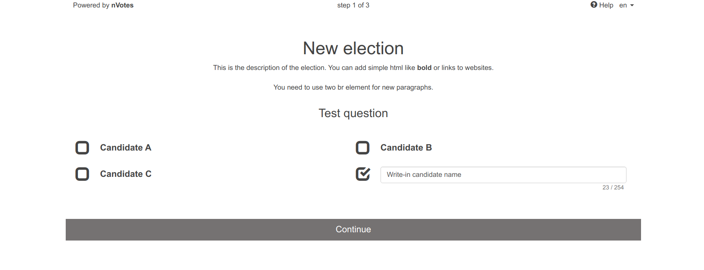
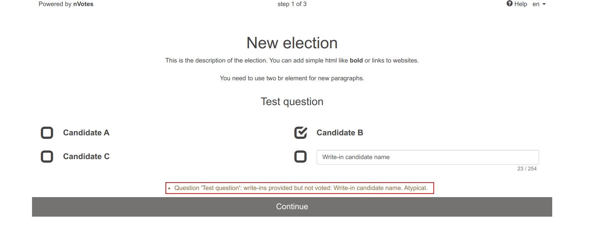
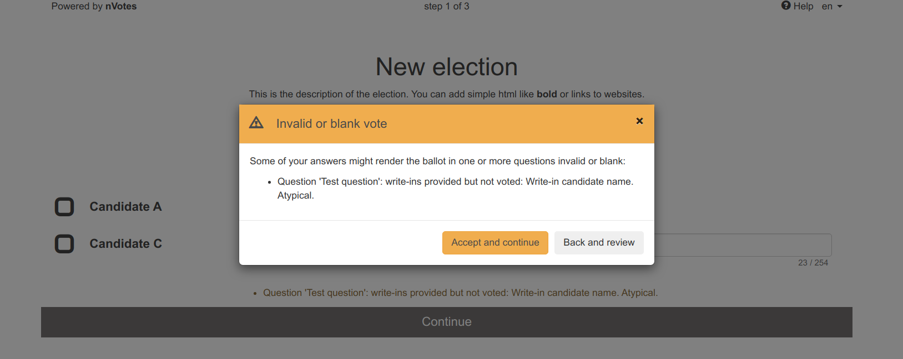
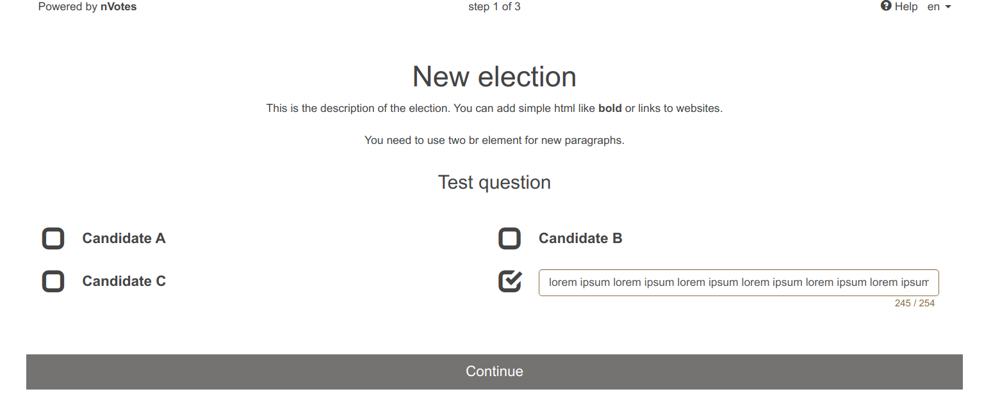
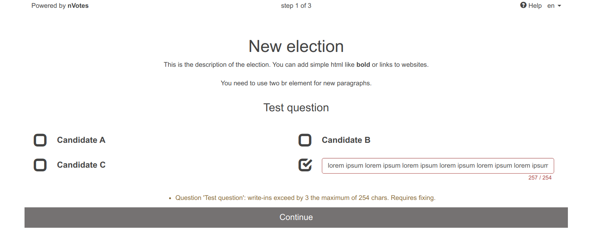
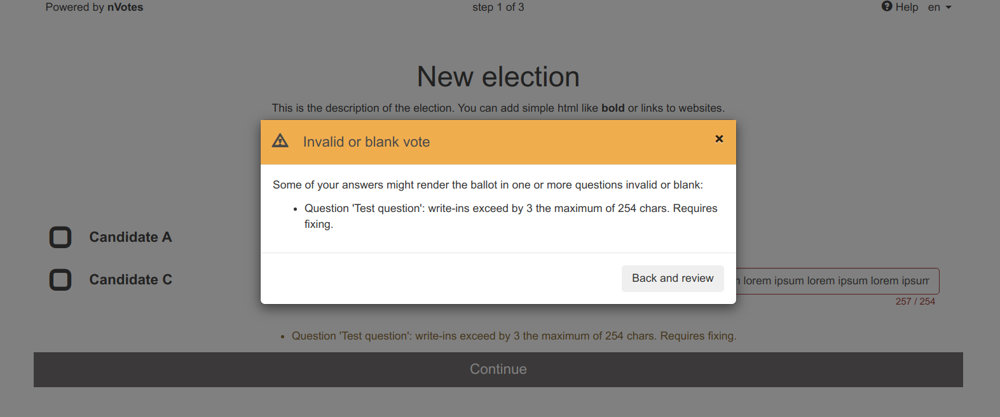
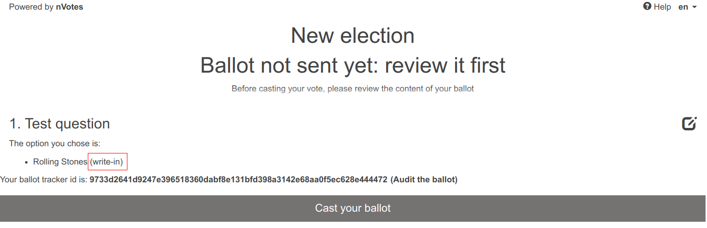
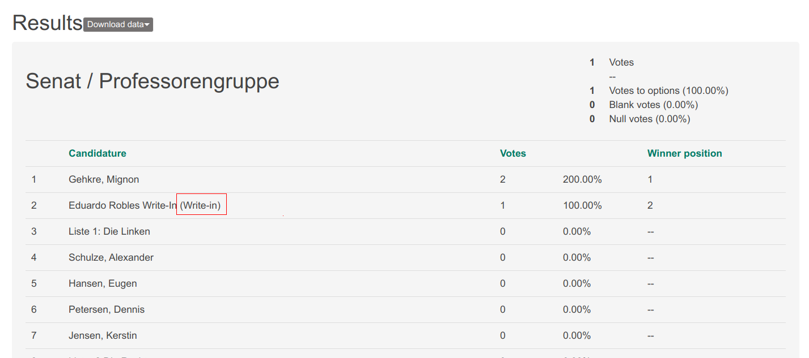

## Introduction

Sequent Platform supports elections with write-in candidates. In this kind of
election the voter can not only vote to the names that appear on the ballot but
also any person's name that the voter writes in the ballot.

## How to

### Election creation JSON

The write-ins support is specified in the 
[Election creation JSON configuration](../../reference/election-creation-json)
and it's configured per question. During the creation of the election, there's 
no native support in the Admin interface to mark a candidate as a write-in, so 
the only way to do it is using the JSON configuration.

To create an election with write-ins in a specific question, you first need
to configure the question to support write-ins. This is done by setting the
[`question.extra_options.allow_writeins`](../../reference/election-creation-json#question-extra-allow_writeins) 
setting to `true`:

```json title="writeins-election.json fragment" {7}
    ... rest of the configution ....

    "questions": [
      {
        "title": "Test question",
        "extra_options": {
          "allow_writeins": true,

    ... rest of the configution ....
```

You also need to add to the question at least one answer with an empty text 
(as it will be provided by the voter, not you) that is marked to be a write-in 
by ensuring the `answer.urls` list contains the element 
`{"title": "isWriteIn", "url": "true"}` as [described here](../../reference/election-creation-json#is-write-in).

For example, if you had 3 normal candidates `Candidate A`, `Candidate B` and
`Candidate C` and allow voters to provide one write-in candidate, the election 
JSON configuration would be similar to:

```json title="writeins-election.json fragment" {18-24}
... rest of the election configution ....
    "answers": [
      {
        "category": "", "details": "", "id": 0, "sort_order": 0,
        "text": "Candidate A",
        "urls": []
      },
      {
        "category": "", "details": "", "id": 1, "sort_order": 1,
        "text": "Candidate B",
        "urls": []
      },
      {
        "category": "", "details": "", "id": 2, "sort_order": 2,
        "text": "Candidate C",
        "urls": []
      },
      {
        "category": "", "details": "", "id": 3, "sort_order": 3,
        "text": "",
        "urls": [
          {"title": "isWriteIn", "url": "true"}
        ]
      }
    ]
... rest of the election configution ....
```

Currently the only 
[question layout](../../reference/election-creation-json#question-layout) 
in the voting booth that supports write-ins is `simultaneous-questions`.

### Write-In Extra Fields

By default write-in answers are configured as a single text input field.
You can separate them into multiple fields, for example Name and Surname.
The resulting write-in will still be a single string, using a template
to join the fields.

This can be achieved by configuring the [`write_in_config`](../../reference/election-creation-json#question-extra-write_in_config) field in the [Question `extra_options`](../../reference/election-creation-json#question-extra_options).

The `write_in_config` consists of an object with the list of fields
and the template to be used. Each field has an `id` which acts as its
name and then it can be reference in the template. For example if the
question has two fields with ids `name` and `surname` then you can
create a template with a string `"{name} - {surname}"` and the final
string for the write-in will be the interpolation of the values of those
fields. If the values are `John` and `Doe`, the final write-in field
will be `John - Doe`.

Furthermore, for each field you can specify the placeholder text for the
input element, as a `label` and a `help` text,  as well as their translations.
The `min` and `max` settings will specify the minimum and maximum number
of characters for the write-in field

This is an example configuration:

```json

  "write_in_config": {
    "fields": [
      {
        "id": "name",
        "placeholder": "Your name",
        "placeholder_i18n": {
          "es": "Tu nombre"
        },
        "label": "Name",
        "label_i18n": {
          "es": "Nombre"
        },
        "help": "(Mandatory) Type your name here",
        "help_i18n": {
          "es": "(Obligatorio) Escribe tu nombre aquí"
        },
        "max": 20,
        "min": 1
      },
      {
        "id": "surname",
        "placeholder": "Your surname",
        "placeholder_i18n": {
          "es": "Tus apellidos"
        },
        "label": "Surname",
        "label_i18n": {
          "es": "Apellidos"
        },
        "help": "Type your surname here",
        "help_i18n": {
          "es": "Escribe tus apellidos aquí"
        },
        "max": 20,
        "min": -1
      }
    ],
    "template": "{name} - {surname}"
  }
```

And this is how it looks:


### Voting booth: behaviour and considerations

Continuing with our example, our
[writeins-election.json](./assets/university_example.yaml) similar to the one
outlined above would look like the following in the voting booth:



#### Atypical warnings

The voting booth will show a warning to voters when:
- The voter votes to a write-in candidate without providing a name.
- The voter provides the name of a write-in candidate without voting it.

Both conditions mentioned are not considered an invalid vote, just atypical. 
For that reason a notification will be shown to voters. These warnings are 
shown just above the continue button like in the following image:



When the voter clicks in the Continue button, this warning is shown as a modal
dialog just to ensure that the voter didn't miss the notification:



#### Duplicated write-ins warnings

The voting booth will show an invalid vote warning in a similar manner when the 
voter writes two identical candidate names in an election where voters can 
provide more than one write-in candidate. The reason this is considered invalid
is that it's quite strange and it would allow to overrule the restraints set
for each candidate. For example even if for each candidate the voters can
only vote once, they would be able to vote twice in a single ballot as they 
wrote the same candidate twice.

Please note that you can enforce that this and other kinds of invalid vote 
warnings are either not shown or enforced to be fixed by using the 
[`question.extra_options.invalid_vote_policy`](../../reference/election-creation-json#question-extra-invalid_vote_policy) 
configuration setting.

#### Write-ins bytes-left notification


As can be seen in the screenshot, in the right bottom corner below each input 
box for each write-in a set of two numbers appears, for example  `23 / 254`. 
These numbers indicate how many bytes have been used to write the write-in 
names (the first number, `23` in the example) and how many bytes can be used.

In this example, it means that the voter can use up to `254` bytes for write-in 
names in this question and it has used so far only `23` bytes. As the voter 
writes the write-ins, the first number increases as the voter is using more and 
more bytes. 

Please note these numbers are not representing characters used/left-to-use, 
but bytes in UTF-8 encoding. Normal characters such as `a-z0-9` use only one
byte but other characters might use more in UTF-8.

The maximum number of bytes that can be used is related to the encoding and to
the `q` value of the public key. Read 
[more information about the encoding of write-ins in the ballot encoding section](../../reference/ballot-encoding#write-ins).

As explained in the 
[ballot encoding section](../../reference/ballot-encoding#write-ins), in a 
ballot the answers are encoded (and encrypted) independently for each question. 
For that reason, the bytes that can be used for write-ins are shared among all 
the write-ins. Thus, we show the same <i>number of bytes used / number of bytes 
available</i> indication for all the write-ins of a single question.

When there are only `10` bytes left to use for the write-ins of a question,
the color of the write-in input box and the <i>number of bytes used / number 
of bytes available</i> indication will change to the default warning color:



#### Write-ins overflow

When the voter overflows the number of bytes that can be used for writing the
names of the write-ins, the indications are set to red and a warning text
telling the user that this requires fixing is shown: 



Even if invalid votes are 
[configured to be allowed](../../reference/election-creation-json#question-extra-invalid_vote_policy), 
this requires fixing by the voter (introducing shorter write-in names) because 
the ballot simply cannot be encoded as it overflows the maximum number of bytes
that can be encoded.

For this reason, when in that situation the voter clicks the `Continue` button,
a warning is shown that compels the voter to fix this issue:



#### Voting booth review screen

In the voting booth, any selected write-in will be listed with a `(write-in)`
postfix to let the user know that this specific candidate is a write-in:



### Election results: the ballot list

In Sequent Administrative interface, once results are calculated, you will be
able to see write-in candidates directly marked with a `(Write-in)` postfix 
just like in this image:



If you click in the `Download data` button and there inside the 
`Download Ballots (JSON format)` you will get access to the ballots in JSON 
format. As will be described in the `Ballots JSON format` document (TODO) in 
the future, this file contains one plaintext ballot for a specific question 
per line. 

Each ballot contains the same list of `answers` as the question it is voting 
for. For write-in candidates (the ones that had the element 
`{"title": "isWriteIn", "url": "true"}` inside `answer.urls` ), if the voter
wrote a specific name for that write-in candidate, the text for the answer
will change. Note that it's technically posible for a ballot to contain a 
write-in answer without voting it and also the opposite,  voting
an empty-named write-in.

### Election results: the election results

The election results changes when the election contains write-ins. All the
answers that are marked as write-ins are removed. Those answers only make sense
to be shown in the voting booth, not in the electoral results, as they have
no candidate name attached.

Instead, all the write-ins names from valid ballots will appear in the election 
results as newly added answers. These answers will have a new answer `id` and
will be marked as write-in in the `answer.urls` section in the JSON format 
results with a `{"title": "isWriteInResult", "url": "true"}` element. In other
results format like PDF or plain text (`pretty`), these write-ins will appear
with a `(Write-in)` postfix.

In the election results, write-ins are grouped by name and not by the answer's
`id`. If the voting booth shows multiple write-in answer fields, it doesn't 
matter in which of them a write-in name the voter wrote the write-in candidate
name: the vote will go to the write-in with that specific name.
