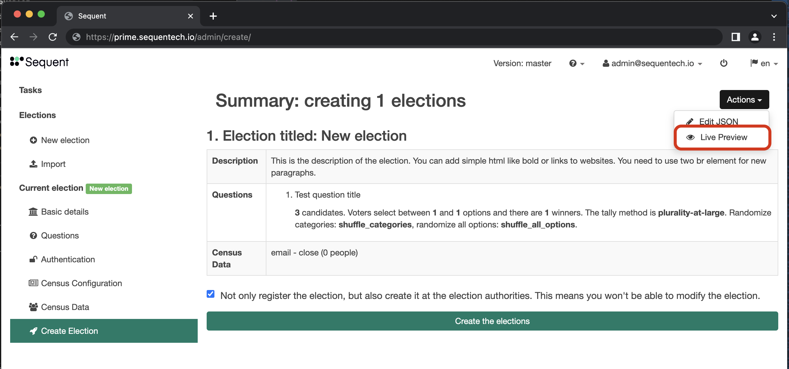
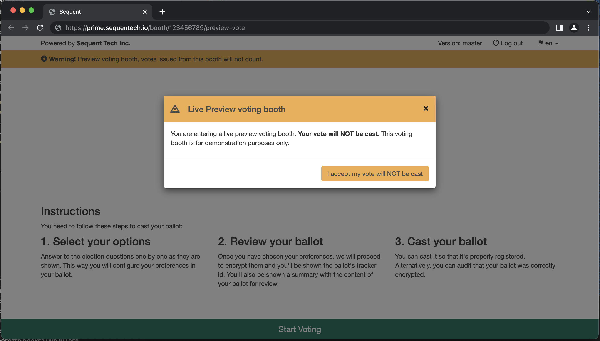
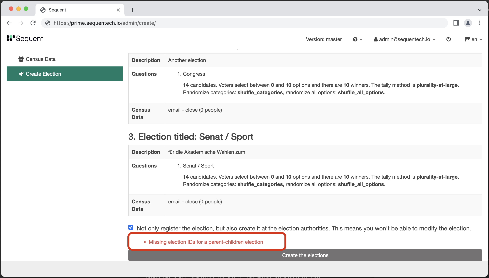

The Live Preview feature allows admin users to see the voting booth before
creating the election, reducing the feedback loop. Here you'll learn how
to access the Live Preview and how it works.

You can access the  Live Preview while creating the election in the admin
console. Go to the last step of creating the election by clicking the
`Create Election` sidebar. Then click the the `Actions` button at the right
top, and then click on `Live Preview` from the dropdown menu. This will 
open the Live Preview in a new tab.

Note that the voting booth shows a popup message and a top banner warning
that the vote will not be cast, as this is only a preview and the election
hasn't been created and the voting period hasn't started yet.

## URL

The way the live preview works is that instead of making API calls to retrieve
the election information, the information is passed from the admin console to
the voting booth by storing it in the session storage.

The `Live Preview` URL has the following format:

    https://sequentech.io/booth/[election-id]/preview-vote

When the voting booth is opened at that url, it retrieves the information on
the election in the session storage for the key `[election-id]`. For example,
if the election id is `123456789`, then the election information will be retrieved
with this call:

    sessionStorage.getItem(123456789)

The format of the election data is the same as the 
[Election Creation JSON](../../reference/election-creation-json), it's just
a stringified version of that (using `JSON.stringify(data)`), as session storage
can only store strings.

The Election Creation JSON only needs to include the id of the election for
Parent-Children elections. In the rest of the cases the JSON will not need the
election ID. In those cases, the ID of the election for the URL is assumed to
be the default value `123456789`.

## Parent and Children Elections

The Live Preview feature supports
[Parent and Children Elections](../guides/parent-and-children-elections/) 
as well, where the parent election is the `[election-id]` in the URL.

If the election is a Parent-Children election and the ids of the elections are
missing, the admin console will show the error at the bottom, and the
Live Preview option will not be available:

